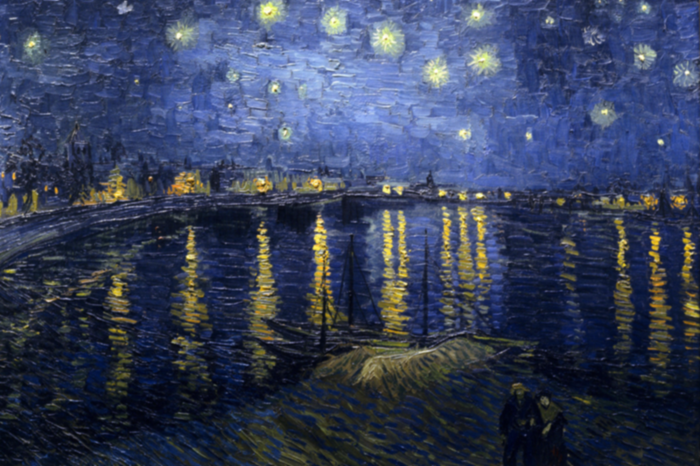

# My solution to homework assignment 2
## Blurs an image on GPU
### Compile
```
mkdir build
cd build
cmake ..
make
```
### Usage
`./hw2 ../example.jpg`

### Runtime with and without using shared memory
1. Without shared memory: 12.8611msecs
1. Filter in shared memory: 2.23747msecs

More speedup possible by putting chunks of the image in shared memory as well. However, the piece of the image that is required is larger than the block of threads:

For example:

*size of block* 32 x 32

*size of filter* 9 x 9

*piece of image that needs to be transfered to shared memory* 36 x 36

We could do that the following way: Each thread copies its respective pixel into shared memory. Threads within a distance of 2 from the edges of the thread block deal with the remaining pixels, etc. In that case, threads that don't have to deal with the padding should copy the filter into shared memory.



