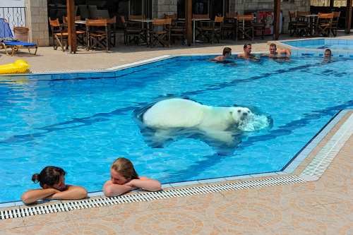
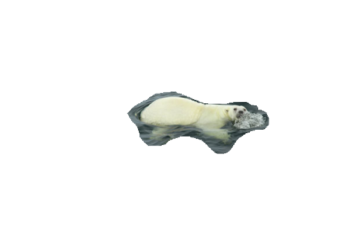
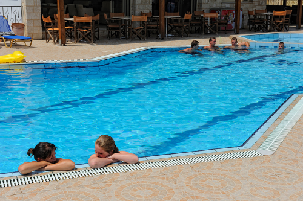

# Assignment 6 - Seamless Image Cloning

[Intro to this assignment](https://www.youtube.com/watch?time_continue=9&v=FwwqQBycjuc)

   The goal for this assignment is to take one image (the source) and
   paste it into another image (the destination) attempting to match the
   two images so that the pasting is non-obvious. This is
   known as a "seamless clone".

   The basic ideas are as follows:

   1) Figure out the interior and border of the source image
   2) Use the values of the border pixels in the destination image 
      as boundary conditions for solving a Poisson equation that tells
      us how to blend the images.
   
      No pixels from the destination except pixels on the border
      are used to compute the match.

   Solving the Poisson Equation
   ============================

   There are multiple ways to solve this equation - we choose an iterative
   method - specifically the Jacobi method. Iterative methods start with
   a guess of the solution and then iterate to try and improve the guess
   until it stops changing.  If the problem was well-suited for the method
   then it will stop and where it stops will be the solution.

   The Jacobi method is the simplest iterative method and converges slowly - 
   that is we need a lot of iterations to get to the answer, but it is the
   easiest method to write.

   Jacobi Iterations
   =================

   Our initial guess is going to be the source image itself.  This is a pretty
   good guess for what the blended image will look like and it means that
   we won't have to do as many iterations compared to if we had started far
   from the final solution.

   ImageGuess_prev (Floating point)
   ImageGuess_next (Floating point)

   DestinationImg
   SourceImg

   Follow these steps to implement one iteration:

   1) For every pixel p in the interior, compute two sums over the four neighboring pixels:
      Sum1: If the neighbor is in the interior then += ImageGuess_prev[neighbor]
             else if the neighbor in on the border then += DestinationImg[neighbor]

      Sum2: += SourceImg[p] - SourceImg[neighbor]   (for all four neighbors)

   2) Calculate the new pixel value:
      float newVal= (Sum1 + Sum2) / 4.f  <------ Notice that the result is FLOATING POINT
      ImageGuess_next[p] = min(255, max(0, newVal)); //clamp to [0, 255]

    In this assignment we will do 800 iterations.

