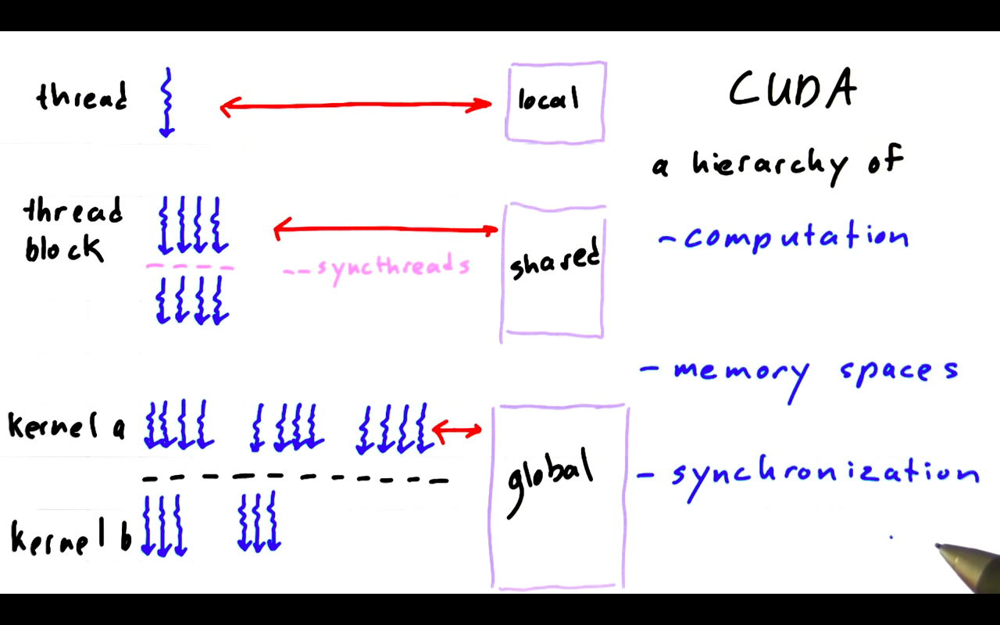
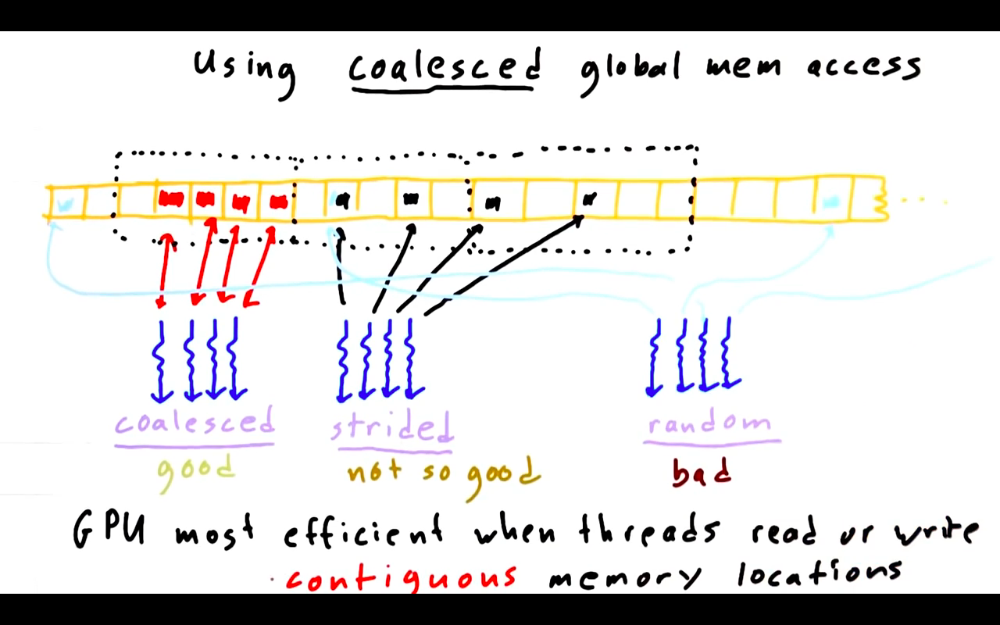
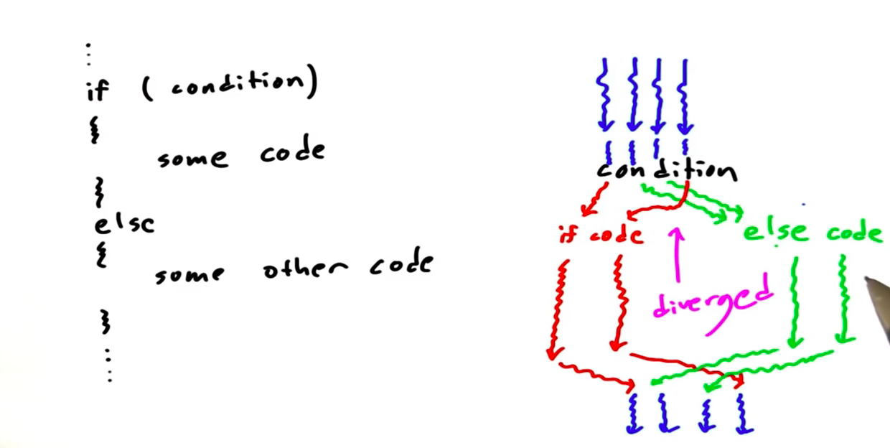
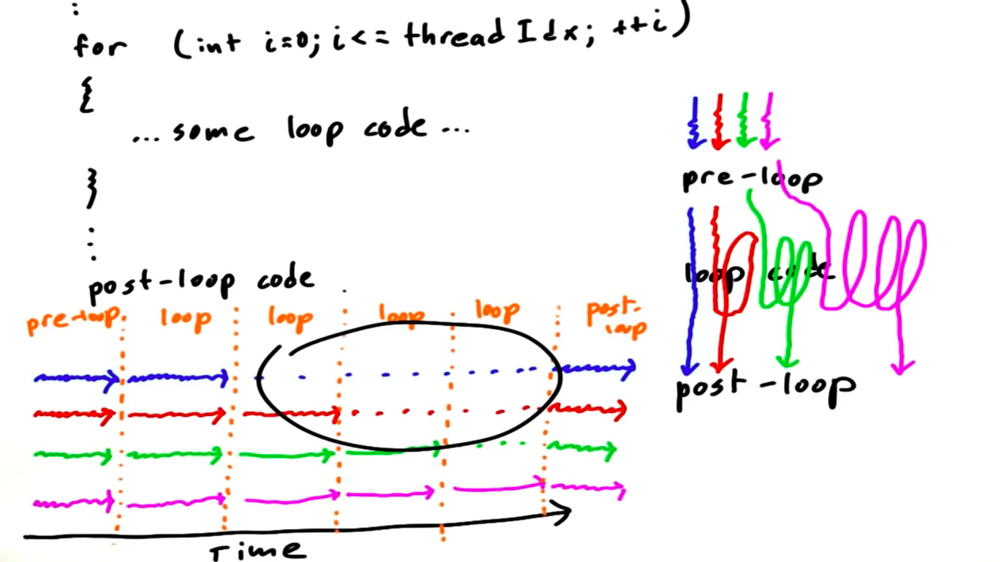

# Lesson 2

## Communication patterns
Threads sometimes need to:

1. read from the same input location
1. write to the same output location
1. exchange partial results

### Map
**One-to-one**
There is a 1 to 1 correspondance between input and ouput, each task reads from and writes to a specific place in memory.

Example:
`out[i] = pi * in[i]`

### Scatter
**One-to-many**
Each task takes an input and calculates the position in the output(s) by itself, for example sorting.

Example:
```
if (i % 2):
   out[i - 1] += pi*in[i];
   out[i + 1] += pi*in[i];
```

### Gather
**Many-to-one**
Examples:

1. Running averages. Each thread reads values from n locations in memory, averages them and writes the result to another location
1. Blur an image: Set each pixel to the average from the neighbouring pixels (stencil)

Example:
`out[i] = (in[i] + in[i - 1] + in[i + 1]) /3.0f;`

### Stencil
**Several in the neighbourhood to one**
Tasks read input from a fixed neighbourhood (stencil) in an array, for example blurring, convolutions,...

Same example as *Gather* if you do it on every element in an array.

### Transpose
**One-to-one: Tasks re-order data elements in memory, always 1 to 1 correspondance**
When you transpose an array, the elements of the array or the pixels of an image are actually laid out one row at a time and have to be written to someplace scattered in memory according to the stride of this transpose.
You could also formulate this as a gather operation, first gathering the input for the first field in the transposed array, then the input for the second field in the transposed array that is stored in a completely different location (not next to the first in the original array).

Example
```
struct foo {
   float f;
   int i;
}
```
If you have an array of these, the array of structures (AOS) is stored in memory like this:

*fifififi*

If you do a lot of processing on the floats, it might be more efficient to acces all the floats contiguosly by converting this to a structure of arrays (SOA) using a transpose operation:

*fffiii*

Example: Convert i major order to j major order
`out[i + j*128] = out[j + i*128]`

## Question we need to answer:
### 1. How can threads efficiently access memory in concert?
### 2. How to exploit data reuse?
### 3. How can threads communicate partial results safely by sharing memory?

## GPU architecture
A GPU consists of many *Streaming Multiprocessors (SMs)*. Different GPUs have different numbers of SMs (1 to maybe 16 or more).

**Important: The GPU is responsible for allocating the blocks to the SMs**.
As a programmer, you worry about giving the GPU the thread blocks, the GPU worries about how to assign them to the hardware SMs.

Answers to Quiz:

1. A thread block contains many threads
1. An SM may run more than one block
1. A block can only run on one SM
1. All threads in a thread block may cooperate to solve a sub problem
1. All threads that run an a given SM may NOT cooperate to solve a subproblem, only the ones in one single threadblock
1. The programmer can neither specify that two blocks X and Y are run at the same time or after each other
1. The programmer cannot specify on wich SM Block X will run

Because the code is independant of the number of SMs on the GPU, the code will scale forwards to larger and larger GPUs but also to smaller ones as found on tablets or cell phones.

```
__global__ void hello() {
  printf("Hello world!; I'm a thread in block %d\n", blockIdx.x);
}

.
.
.

hello<<<16, 1>>>();
```

This has 16! possible different outputs because each block of code has a different idx, thus output, but the *order is random*.

### Things CUDA guarantees:
1. All threads in a block run on the same SM at the same time
1. All blocks in a kernel finish before any blocks from the next kernel run

## Memory
Every thread has access to three kinds of memory on the GPU:

1. Local memory that belongs only to the thread
1. Shared memory. Shared between threads of one block. Small amount of memory that sits on the SM directly
1. Global memory. Accessible by threads everywhere

Data is passed by the CPU from the host/CPU memory to the device/GPU memory (global) before launching kernels

### Problem: Threads need to synchronize to avoid accessing a result in global or shared memory before another thread wrote it

## Synchronization
### Barrier
Point in the code where threads stop and wait. When *all* threads have reached the barrier, they can proceed.

`__syncthreads();` creates a barrier within a thread block;

**Example 1:** Filling a shared array with numbers and shifting it one to the left. How many barriers are needed?

```
.
.
.
int idx = threadIdx.x;
__shared__ int array[128];
array[idx] = idx;

// Here the first barrier is needed, array has to be completely filled
__syncthreads();  

if (idx < 127) {
   int temp = array[idx + 1];
   
   __syncthreads();  // All threads must read before changing the array

   array[idx] = temp;
    
    __syncthreads(); // To be safe sync before anybody else can use these values
}
.
.
.
```

**Example 2:** Wrong `s[i] = s[i - 1];`

**Example 3:** Ok `if (i % 2): s[i] = s[i - 1];` (Apart from the fact that i = 0 creates a problem)

**Example 4:** Wrong `s[i] = (s[i - 1] + s[i] + s[i + 1])/3.0f;`


Between two kernels there is an implicit barrier. Kernel A finishes before kernel B starts.

## What we got now is CUDA
A hierarchy of

1. computation (threads, thread blocks and kernels)
1. memory spaces (local, shared, global)
1. synchronization primitives (sync barriers and the implicit barrier between two kernels)



# Writing *efficient* GPU programs
GTX 1080 Ti can do more than 11 TFLOPS (Trillion math operations/floating point operations per second)!

**However, all that power is wasted if the arithmetic units doing the math are waiting while the system fetches operands from memory!**

**Principle: Maximize arithmetic intensity**

Arithmatic intensity is the amount of math we do per amount of memory that we access.

1. Maximize number of useful compute ops per thread
1. Minimize time spent on memory access per thread

## How to minimize time spent on memory access
Transfer frequently used data to fast memory on the GPU. local > shared >> global >> CPU (> meaning faster than)

### Use of *local* memory:
```
__global__ void use_local_memory_GPU(float in) {
   float f;
   f = in;
}

.
.
.

use_local_memory_GPU<<<1, 128>>(2.0f);
```

### Use of *global* memory:
```
__global__ void use_global_memory_GPU(float *array) {
   // "array" is a pointer into global memory on the device
   array[threadIdx.x] = 2.0f * (float) threadIdx.x;
}
.
.
.
int main() {
   float h_arr[128];  // host memory
   float *d_arr;

   // allocate global memory on the device, place result in "d_arr"
   cudaMalloc((void **) &d_arr, sizeof(float) * 128);
   // copy data to deivce (passing pointer to the destination memory and pointer to source memory)
   cudaMemcpy((void *) d_arr, (void *)h_arr, sizeof(float) * 128, cudaMemcpyHostToDevice);
   // launch the kernel, passing the pointer to the data in global memory as local variable
   use_global_memory_GPU<<<1, 128>>>(d_arr);
   // copy memory back
   cudaMemcpy((void *) h_arr, (void *) d_arr, sizeof(float) * 128, cudaMemcpyDeviceToHost);
```

Note: We need to pass a pointer to a pointer because `cudaMalloc` needs to change the pointer itself but uses the return value for an error code.

**Modern CUDA versions don't require you do cast to `void *`!**

### Use of *shared* memory
```
// Omitting out-of-bound checks
__global__ void use_shared_memory_GPU(float *array) {

   // local variables, private to each thread
   int i, index = threadIdx.x;
   float average, sum = 0.0f;

   // __shared__ variables are visible to all threads in this thread block, lives as long as this thread block
   __shared__ float sh_arr[128];
   
   // copy data from "array" in glob mem to shared mem
   // each thread is responsible for copying a single element
   sh_arr[index] = array[index];

   __syncthreads();  // ensure all writes to shared mem have completed

   // Let's find the average of all previous elements to this index
   // We use shared mem because its a lot faster than global mem and is used a lot
   for (i = 0; i < index; i++) { sum += sh_arr[i]; }
   average = sum / (index + 1.0f);
   // (Actually this give thread divergence)

   // Task: replace all fields with the average if the field is > than the average
   // Operate on global memory so it can be seen by the host or other thread blocks
   if (array[index] > avarage) { array[index] = average; }

   // These lines do nothing because the shared mem goes out of scope anyway
   __syncthreads();  // Needed however, to make sure shared mem is not changed before all threads calculated the average
   sh_arr[index] = 3.14f;
}
```

## Coalesce global memory access
An access pattern is *coalesce* when threads read or write contiguos global memory locations.

When a thread accesses a field in an array, it actually accesses a larger chunk of memory. It is efficient if other threads access fields in that same chunk and ineficcient if every thread accesses a field in a different chunck:



Global memory access is fastet when **successive threads read or write adjacent locations in a continuous strech of memory.**
The larger the strides, the more total memory transactions you have to do.

## Atomic memory operations
### Cost of time

1000000 total threads in 1000 blocks write into 10 elements performing the following operation: `g[i] = g[i] + 1;`

Result: `26 26 25 25 25 25 25 25 24 24`

Problem: Many threads access the array at the same time.

One possible fix: Insert barriers into the code

Better Alternative: atomic operations (short *atomics*)

1. `atomicAdd()`
1. `atomicMin()`
1. `atomicXOR()`
1. `atomicCAS()` (compare and swap)
1. ...

Without *atomicAdd* (wrong result): `Time elapsed = 0.521312 ms`

With *atomicAdd*: `Time elapsed = 0.397504 ms`

According to course, atomic operations should take longer! One should be aware of this but since they are very convenient the course instructor recommends to *not necessarily freak out about the cost since it is often neglible*

### Limitations of atomics

1. Only certain operations are supported: add, subtract, min, xor, etc. exist but mod or exp don't
1. Only certain data types are supported: Only atomic exchange and add support floating point operations. Workaraound using `atomicCAS()`
1. Still no ordering constraints! This is important because floating-point arithmetic is *non-associative*: $(a+b)+c\ne a+(b+c)$ for float (just try with $a=1$, $b=10^{99} and $c=-10^{99}$).
1. Serializes access to memory which makes it **slower**!

# Summarizing lesson 2
## Communication patterns 
1. gather
1. scatter
1. stencil
1. transpose

## GPU hardware & programming model
1. SMs (streaming multiprocessors)
1. threads
1. blocks
1. what assumptions to make and not to make about in what order threads will run
1. how to synchronize threads and threadblocks to safely share data and memory
1. Memory model: local, shared, global, atomics

## Strategies for efficient CUDA programming
 1. High arithmetic intensity:
  - Minimize time spent on memory
  - put frequently used data in faster memory local > shared > global
  - use *coalesced* global memory access: adjacent threads access contiguos chunks of memory
 1. Avoid thread divergence (threads that do different things)
  - `if else` statements
  - `for (int i = 0; i < threadIdx.x; i++) {`  



