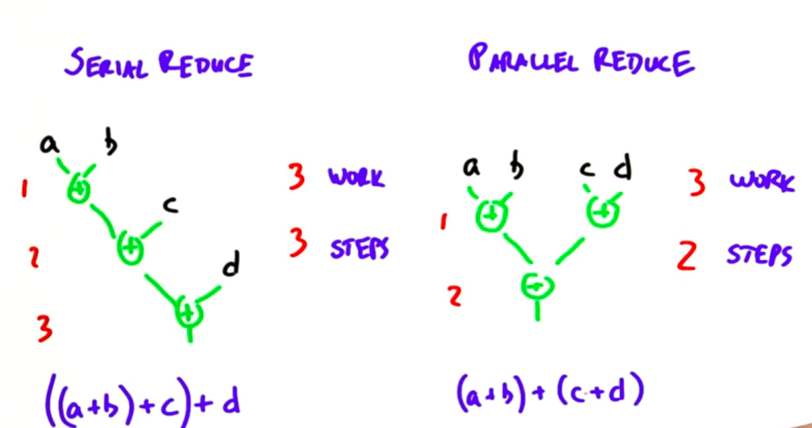

# Lesson 3
## Fundamental GPU algorithms:
1. Reduce
1. Scan
1. Histogram

## Example: digging a hole:

| # workers            | 1 | 4             | 4                                |            |
|----------------------|---|---------------|----------------------------------|------------|
| Time to finish       | 8 | 2             | 4                                | <= "steps" |
| Total amount of work | 8 | 8             | 16                               | <= "work"  |
|                      |   | ideal scaling | the workers got in each others way |            |

**There are two types of cost:**

1. Step complexity (3, depth of tree)
1. Work complexity (7, number of nodes in tree)


We say that a parallel algorithm is *work-efficient* if its work complexity is asymtotically the same (within a constant factor) as the work complexity of the sequential algorithm.

If we can reduce the *step complexity* in our parallel implementation compared to serial implementation with a reasonable *work complexity* the runtime will be faster overall.

## Reduce

**Simplest example:** Calculate the sum of a sequence of numbers. Requires cooperation between processors.


**Reduce: inputs**

1. Set of elements
2. Reduction operator

\begin{equation}
\text{Reduce[(19, 8, 9, 14), + ]}
\end{equation}

**Operators have to be:**

1. binary (take two inputs and create one output).
2. associative ( a "op" b ) "op" c = a "op" (b "op" c)

**Examples:**

1. Multiply
2. Minimum (a min b)
3. Logical or (a || b)
4. Logical and (a & b)

### Implement reduce serially


1. 4 operations (work complexity)
2. 4 steps (step complexity)

```
sum = 0
for (i = 0; i < elem.len(); i++) {
	sum = sum + elem[i];
}

```

Serial reduce takes *n-1* operations and the work complexity is $\mathcal O(n)$. Step complexity is $\mathcal O(n)$ as well.

### Implement reduce in parallel

Use associativity:
\begin{equation}
((a+b)+c)+d = ((a+b)+(c+d))
\end{equation}



**Serial:**

1. Work complexity $\mathcal O(n)$
2. Step complexity $\mathcal O(n)$

**Parallel:**

1. Work complexity $\mathcal O(n)$
2. Step complexity $\mathcal O(\log n)$

**Important note:** The GPU has to be able to handle the number operations at every depth of the tree at the same time. Still significant speedup but not $\mathcal O(\log n)$. This is called *Brent*s theorem*.

**Brent's theorem: Execution on a limited number of processors:**

Analysis of parallel algorithms is usually carried out under the assumption that an unbounded number of processors is available. This is unrealistic, but not a problem, since any computation that can run in parallel on N processors can be executed on p < N processors by letting each processor execute multiple units of work. A result called Brent's law states that one can perform such a "simulation" in time Tp, bounded by:
$T_p\le T_N + \frac{T_1 - T_N}{p}$

[source](https://en.wikipedia.org/wiki/Analysis_of_parallel_algorithms)

### Implementation of reduce

See file `reduce.cu`

**General idea:**

1. `d_in` contains the numbers to reduce with the operation "+"
2. `d_intermediate` serves as a storage for intermediate results
3. result will be written into `d_out`
4. every block gets a chunk of the array (let's say 1024 entries)
5. Now do the following: first half of threads in the block adds the second half of the entries onto the first half. Sync the threads. First quarter of threads adds second quarter of entries onto first quarter of entries. Sync the threads. First eighth of the threads, ...
6. Each block writes its resulting number into `d_intermediate` 
7. Do the same for `d_intermediate` and write the result into `d_out`. The assumption here is, that this can be done by one single block.

**Important note**: The kernel that uses shared memory in the official lecture code snippets gives the right result, the simpler one that uses global memory **does not!** TODO: figure out why...

**Global vs shared: memory bandwidth**

The global version uses 3 times more memory bandwith than the shared version.

| Global read | Global write | Shared read | Shared write | 
|-------------|--------------|-------------|--------------|
| 1024 | 512 | 1024 | 1 |  
| 512 | 265 |  |  |  
| 265 | 128 |  |  |  
| ...| ... | | | 
| 1 | 1 | | | 

Shared memory use gives a speedup of around 30%

More micro-optimisations needed to max out performance of reduce:

1. Process multiple items per thread instead of just 1
2. Do the first step of reduction directly while reading the array into shared memory
3. Take advantage of the fact that warps are synchronous while doing the last step of reduction (what does this mean?)

## Scan
Inputs to scan:

1. Input array
2. Binary associative operator
3. Identity element

**Adresses a set of problems that otherwise are difficult to parallelize.**

**Not useful in serial but VERY useful in parallel!**

### Examples

**Exclusive running sum (not including the current element):**

* Input: 1, 2, 3, 4
* Operation: Add
* Output: I=0, 1, 3, 6

Balanching a checkbook would be inclusive scan.


### Serial implementation (inclusive)
Flip two lines in loop to convert to *exclusive* scan.

```
int acc = identity;
for (i = 0; i < elements.size(); i++) {
	acc = acc op element[i];
	out[i] = acc;
}
```

**Work:** n

**Step:** n

### Parallel implementation

#### Naive implementation
Calculating the first element of the output is a reduce operation on the first element in the input. The second output is the result of a reduce on the first two inputs. The third output is a reduce of the first three inputs...

**Steps:** $\mathcal O(\log n)$ because the last element of the output is a reduce on all n input elements. The other outputs cost less.

**Work:** The first output is a reduce on 1 input, the second output a reduce on 2 inputs,...

$1+2+...+ (n-1)\approx n^2/2$

Therefore $\mathcal O(n^2)$, which means we need a better implementation!

#### More efficient implementations 

|  | More step efficient | More work efficient |
|-----------------|---------------------|---------------------|
| Hillis + Steele | X |  |
| Blelloch |  | X |


Step complexity is proportional to the "depth", thus $\mathcal O(\log n)$.

Work complexity is proportional to the "area", thus $\mathcal O(n\log n)$.


**Reduce phase:**

**Steps:** $\log n$

**Work:** $\mathcal O(n)$ (n-1 additions)


**Downsweep phase:** Exactly the same because it is mirrored!

This is great because now we have $\mathcal O(n)$ work, just as the serial implementation.

Blelloch has $2\log n$ steps, whereas Hillis & Steele has $\log n$ steps. However, Blelloch is less work overall.

#### How to choose which one to use?

1. **More work than processors:** work efficient
2. **More processors than work:**  step efficient, since you have plenty of processors and are willing to do extra work to save some steps.


## Histogram
### Parallel implementation
#### Implementation using *atomics*
**Problem:**
When we want to increment the count of a bin in parallel, three things are happening:

1. Read bin value from global memory
2. Locally increment bin value in a register
3. Write incremented bin value to global memory

**Threads will interfere!**

**Solution:** Turn those three operations into one using *atomic add*. The GPU locks down a particular memory location during the read, modify, write so that no other thread can access it.

```
__global__ void simple_histo(int *d_bins, const int *d_in, const int BIN_COUNT)
{
    int myId = threadIdx.x + blockDim.x * blockIdx.x;
    int myItem = d_in[myId];
    int myBin = myItem % BIN_COUNT;
    atomicAdd(&(d_bins[myBin]), 1);
}
```

**Downside:** This serializes the memory access, performance limiter.

#### Per-thread histograms, then reduce

**Idea:** We give each thread a set of items to bin and a local copy of the histogram to bin into. In that way we do *not* need atomic add!

Then use the **reduction** technique within a block to combine the n_threads histograms in that block into one single histogram.

Then use a single thread in that block to add the per-block histogram to the global histogram using atomic add.


#### Sort, then reduce by key


Use *sort* and *reduce by key* from *thrust* library that accompanies CUDA.