# Lesson 4
## Fundamental GPU algorithms part 2:
### Applications of *scan* and sorting on the GPU

## Recap of scan

*Scan* can be used for running total/running sum but also other binary associative operations like Min, Max and most logical operations.

In the best GPU scan implementations:

1. Amount of work $\mathcal O(n)$
2. Amount of steps $\mathcal O(\log n)$

## Compact (filter)
*Compact the large input set into a smaller set.*

Examples:

1. From a large amount of students, filter out students that scored higher than a certain grade.
2. In computer graphics filter out a set of objects from a larger group of objects that currently needs to be drawn onto the screen.
3. Filter out specific cards from a hand of cards

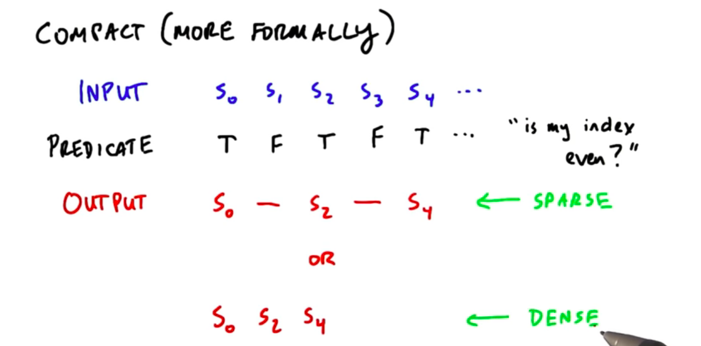

Often a dense output is preferable. To understand why let's look at an example: Filter out 13 diamonds from 52 cards

#### Sparse approach
```
if (card.isDiamond()) {
	computeCard();
}
```
Launches 52 threads of which 39 will be idle.
#### Dense approach
```
cc = compact(cards, isDiamond());

map(cc, computeCard());
```
Launches 52 threads for the *compact* but only 13 threads for the `computeCard()`. Especially when `computeCard()` is expensive it is worth not having the other 39 threads idle.

**Compact is most useful when we compact away a *large* number of elements and the computation on each remaining element is *expensive*.**

How do we implement the *compact* operation?
**Exclusive-sum-scan!**


Four steps (efficient implementation might combine some of these):

1. Run a *predicate* on the elements
2. Create a *scan-in* array: True -> 1, False -> 0
3. *Exclusive-sum-scan* on *scan-in* outputs the scatter addresses for compact array
4. Scatter input into output using these addresses if the predicate is true

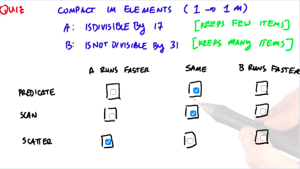
Scatter is faster because there are fewer memory operations!

Generally speaking *compact* allocates exactly 1 item in the output for each true input and 0 items in the output for each false input.

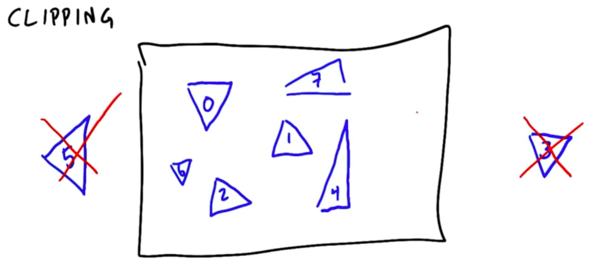

We could also do a *compact-like* operation that computes the number of output items dynamically for each input item.

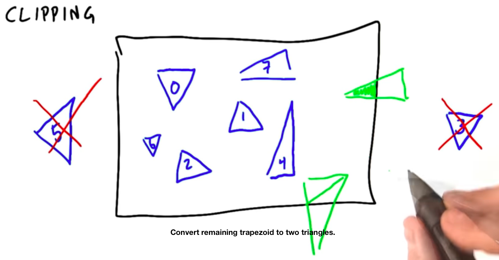

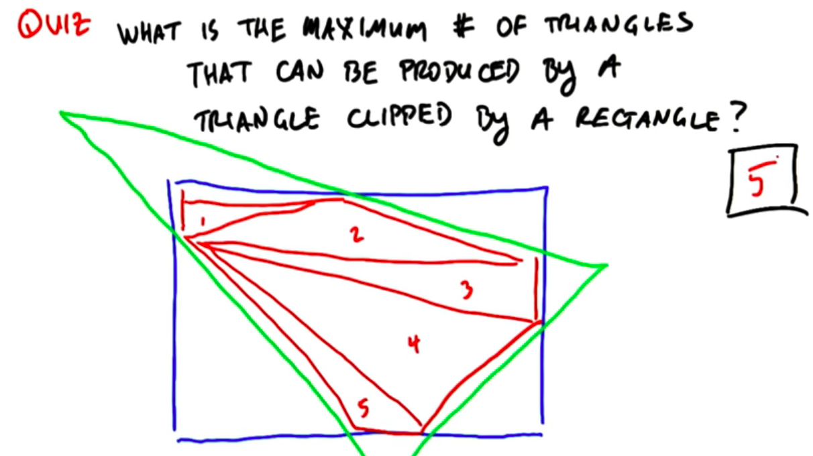

So if the number of outputs per input is calculated dynamically, how much memory do you allocate?

We could allocate the maximum space per input element in an intermediate array and then compact the result. However, this is wasteful in space and would require that we scan the large intermediate array.

A better way to do this would be to input not whether the triangle has an output (pred = 1) but the number of outputs it has and then perform the scan.

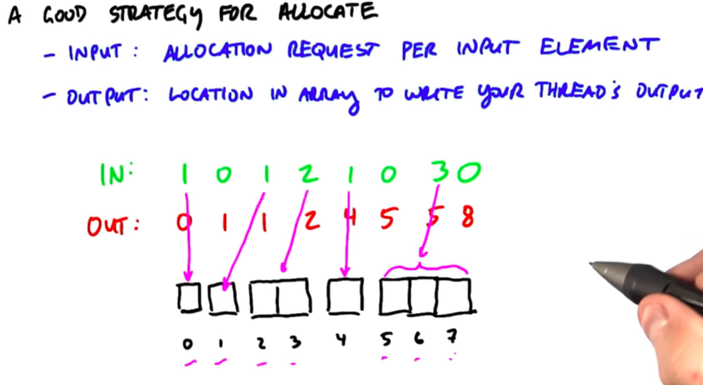

## Segmented scan

When you have to do many small scans, there are two options:

1. Launch a kernel for each small scan indepently
2. Combine as segments into large array and do a *segmented scan*. 

Second options is often better because when you launch you want it to have a lot of work to do.

We now need a special scan operator that scans each of the segments indepently.

To indicate where segments begin, we might use a second array that contains 1s for segment heads and 0s for non segment heads.

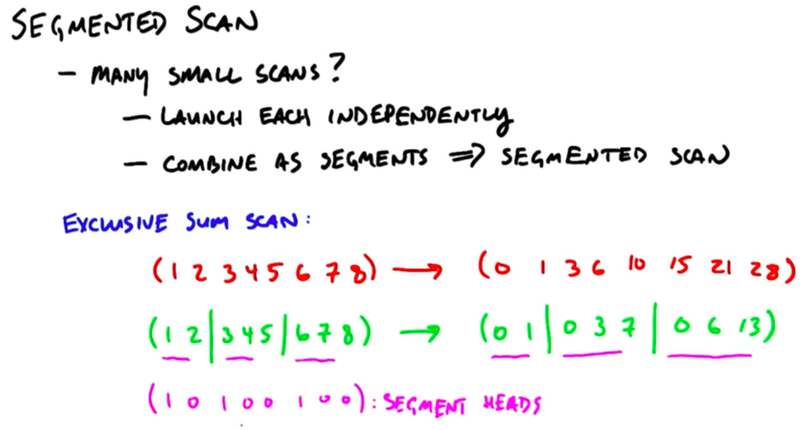

**TODO:** Course does not implement this, do it myself

## Sparse matrices

*Compressed sparse row (CSR)* representation is useful when you have large matrices with many zeros.

Instead of one matrix you have three vectors:

1. Value vector represents all non-zero data
2. Column vector represents the columns each of the data came from
3. Row-PTR contains the indices where the rows begin

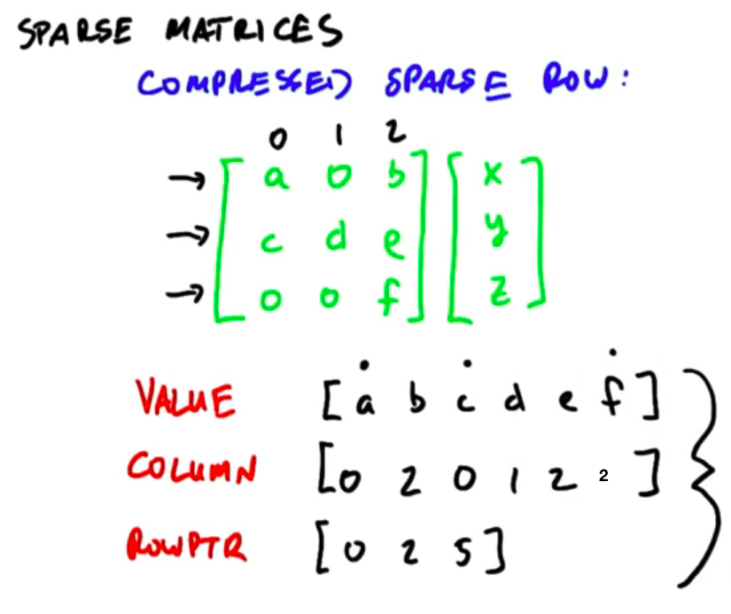
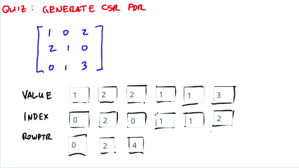

## Matirx multiplication of sparse matrices

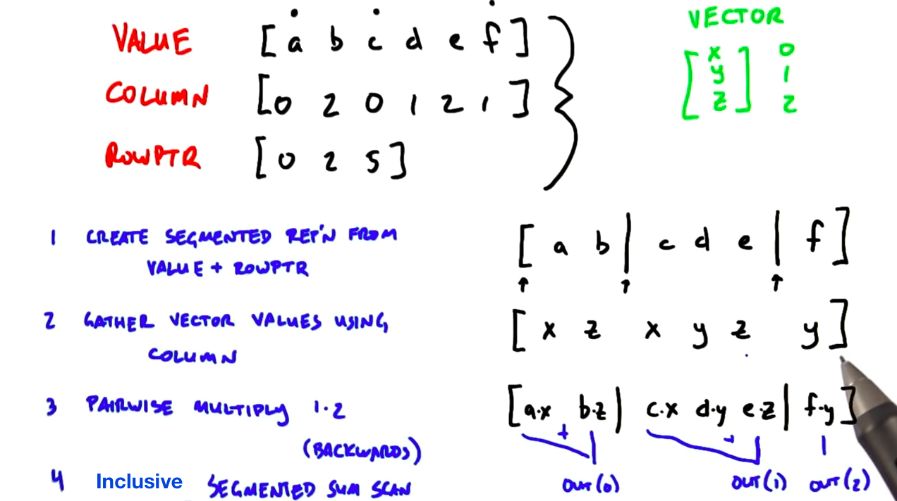
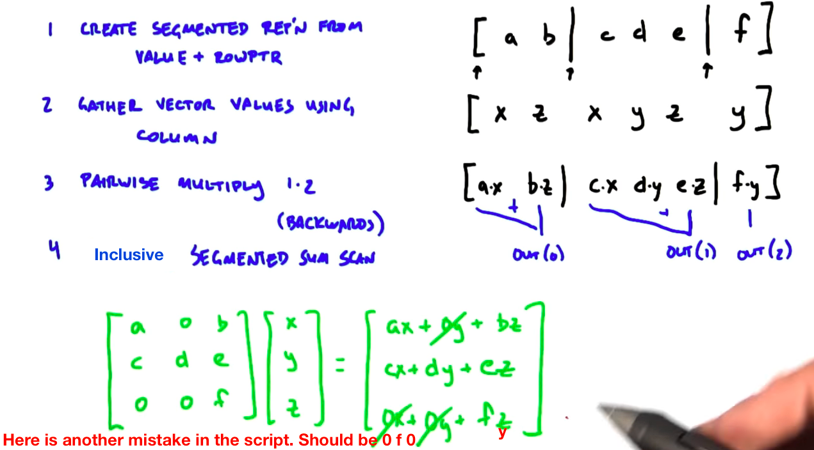
Substantially more efficient for a real matrix that has a significant amount of 0's.

It's actually easier to do the scan backwards because then we can use RowPtr to gather the results. We could also do a segmented reduce which is slightly more efficient than segmented scan.

## Sort

1. Lot's of serial algorithms!
2. Fewer parallel algorithms :(

We want parallel algorithms that ...

1. ... keep the hardware busy (lots of threads busy at same time).
2. ... limit branch divergence.
3. ... prefer coalesce memory access.

Serial sorting algorithms ...

1. ... tend to be moving little bits of memory at a time.
2. ... have "very branchy" code.

### Odd-even Sort (Brick sort) / parallel version of *Bubble sort*

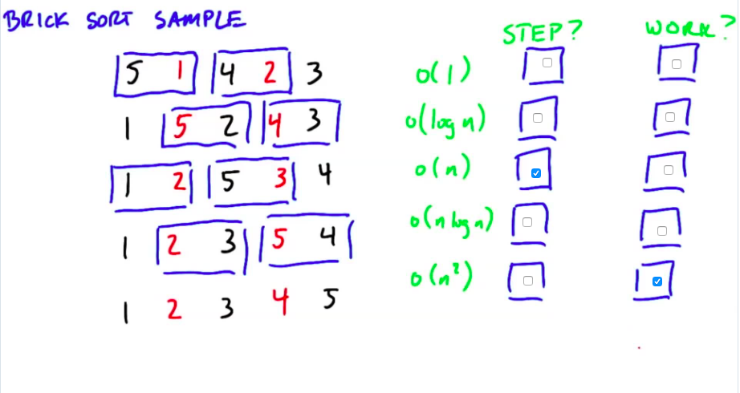
Red (odd) elements first pair with element on the left, then with element on the right, then left, ... Swap when necessary.

Serial implementation: Best case runtime $\mathcal O(n)$, average and worst case runtime $\mathcal O(n^2)$. So runtime of parallel version is better than the average serial runtime.

### Merge Sort
Tree that represents the merge sort:

There are $\log(n)$ steps and at each level we touch all $n$ elements. The total work therefore is $\mathcal O(n\log(n))$.

The problem starts of with many tiny parallel problems. Eventually, we end up with only one large element to solve (final merge).

What we do at each level of the computation is the same:

Merge two lists of sorted elements into one.

We start with n lists of *sorted* one-element lists. Do n/2 merges and have n/2 *sorted* two-element lists. Do n/4 merges and have n/4 *sorted* four-element lists.

The hard part about implementing this on GPU is that the number and size of the merges differs greatly between the levels.

Let's devide this into three stages:

1. **stage (blue)**: many tasks, each task small amount of work. We therefore assign **one merge to one thread** which can perform each individual merge using a serial algorithm. For better performance use coalesce memory access by using shared memory as a staging area to read from and write to. In reality for the blue stage one would not even use merge sort. More later...
2. **stage (black)**: Lots of small sorted blocks and we need to merge these small sorted blocks together. For these intermediate merges we could assign **one merge to one threadblock**.

How do we merge two sorted sequences in parallel?

If we had two sorted sequences of 4 items each, we would launch 8 threads. Job of each thread: calculate the position of the respective element in the final list and then scatter the element there.

How to calculate the scatter addresses:

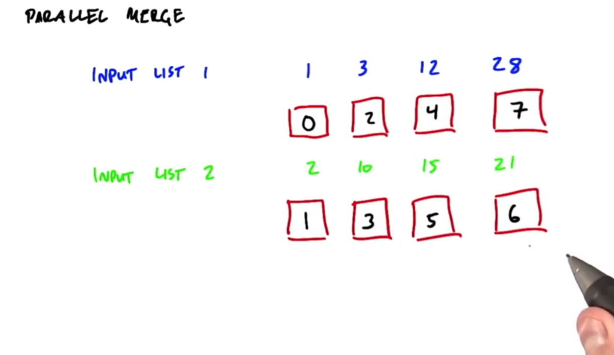

Assuming we are the thread that needs to find the scatter address for the 12. How do I know my position in my own list? Since the list is sorted and we launched the threads as a contiguos block with one element per thread, my index in my own list is equal to the thread id. How do we know our position in the other list? We need to do a binary search in the other list.
When we have our position in both lists, our final scatter address is the sum of both positions.
Every thread does an independent binary search in the second list. Fast if we do this in shared memory.

This method works well in the middle black section where one SM deals with one merge.

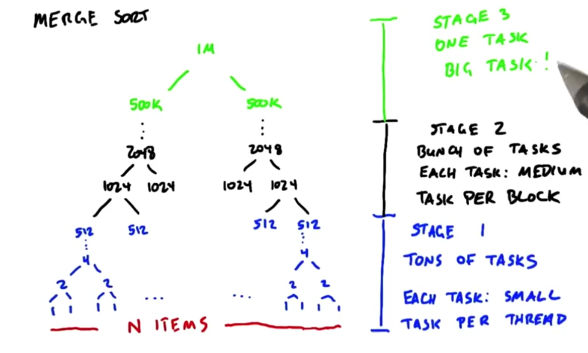

In the green section we have one **big** task. This is bad for efficiency because most of our SMs are idling!! The method we discussed is able to keep all threads in one SM busy but we do not know yet how we can keep several SMs busy on one merge.

We therefore need an algorithm that allows us to split one big merge across several SMs.

The big merge is to big anyways to be done on one SM.

First step: Create two lists of *splitters*, i.e. every 256th element, for both sorted sequences. 

Use the algorithm we already know to merge those two sorted lists of splitters into one.

The elements that fall between two splitters in this sorted list are an independent set that can be sorted on one SM.

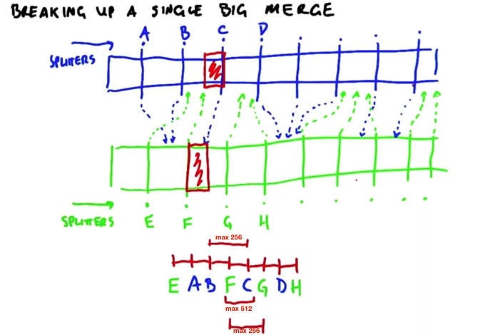

Let's look at the example F&C

1. Calculate the position of C in F's list (binary search)
2. Calculate the position of F in C's list
3. Since two splitters in the same list are 256 indices apart, one block in the total list, i.e. between F and C, cannot be larget than 512 elements, thus, small enough for one SM.

**Summary:**

1. Stage: One thread block to do many small merges
2. Stage: One thread block one larger merge
3. Stage: Many thread blocks one big merge so that SMs can be kept busy.

### Sorting networks
*Sorting algorithm that always does the exact same steps (oblivious). Is good for implementation on GPU because in contrast to CPU they are not good at complex control flows.*

#### Bitonic sorting network
**Bitonic** means that the sequence has an "up" part followed by a "down" part, but not "up, down, up".
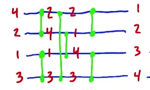

Every time to numbers are connected by green line, they are swapped if out of order.

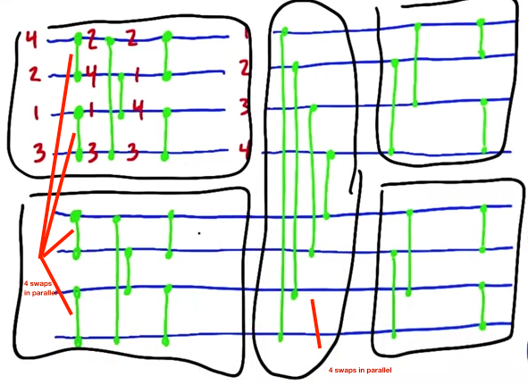
Left boxes sort two sequences of size 4, middle box splits two sorted sequences into a larger and a smaller half. The two boxes on the right sort the two resulting bitonic sequences.

Watch video 196 for an explanation. 

The nice thing about such sorting networks is that it is completely irrelevant whether the input sequence is completely sorted, almost sorted, reversed or random. Sorting always takes the same amount of time.

How would we implement this one the GPU?
One thread per blue line (each comparison twice). At each comparison/swap each thread decides whether it will keep the smaller or the larger element. After evey "column of swaps" we need to sync the threads.

If sequence is small enough to fit into shared memory than such a sorting network is very efficient. Often used in the lowest stage of a merge sort.

#### Odd-even merging network / brick sort (bubble sort in serial)
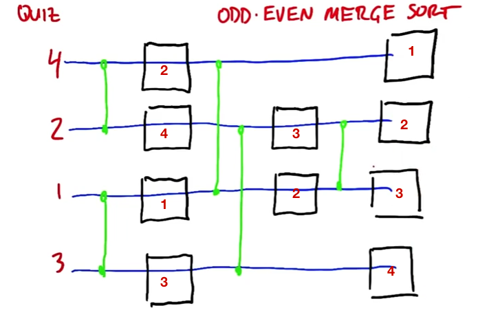

### Radix sort (best GPU sorting algorithm)

All algorithms discussed until now always compared two numbers. Radix sort works with the bit representation.

1. Start with the least significant bit
2. Split into two sets based on whether the LSB is a 0 or a 1, **otherwise preserve order!**
3. Proceed to the next least significant bit and do the same until you are out of bits and have a sorted sequence.

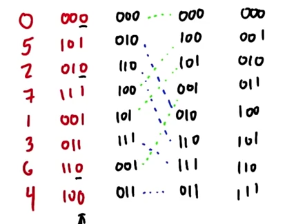

Two reasons that this runs great on GPU:

1. Work complexity: Best comparison based algorithms are O(N log N), this one is O(kN) where k is the number of bits in representation.
2. The underlying algorithm that we need to do this split based on the input is an efficient algorithm we already know: **Compact**

What is the predicate on a uint i? Answer: `(i&1) == 0`

This should be a *map* operation, right?

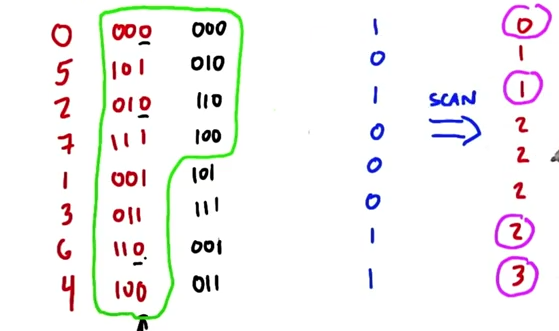

Once we have the predicates, we do an exclusive sum scan to get the scatter addresses.

### Quicksort
One of the most efficient sorting algorithms for serial computations but complex to implement on GPU because of complex control flow. Also many GPUs don't support recursion (kernels calling kernels).


All the operations can be done with segmented scans instead of recursion:

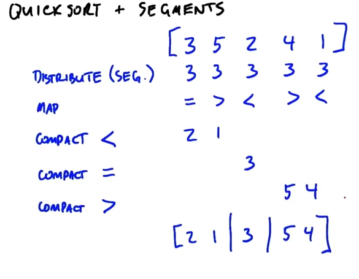

However, this is challenging to implement with segmented scans and challenging to optimize. Much more straight forward with recursion.

### Key-value sort
Final note on sort. All the algorithms we discussed were what we call key sorts,
where we only sort a set of keys. Many interesting applications, however, require that you sort not just a key, but a value associated with that key. For instance, in unit two Dave described sorting a set of NBA players by height. 
In this case, the key might be the height, and the value would be the player's name, the player's team, the player's history and so on. Dealing with values as well as keys is pretty straightforward. First, if you have a value that's large in terms of bytes, it's usually smarter to make the value instead, a pointer to the actual data, and then just sort the value and its pointer. For instance, if you had a large NBA player data structure, don't sort the whole data structure as the value. Instead, just use a pointer to the data structure as the value. 

Second, our sort algorithms generally move around data keys, whether that be a sorting network, or a radix sort, or a merge. Instead of just moving the key, if you have to deal with a key value sort, move the key and the value together as one unit. Finally, since today's GPUs can often natively handle 64-bit data, it might make sense to use a 64-bit data type to store both a 32-bit key and a 32-bit value and just change any comparison functions you have to input 64-bit values instead.


