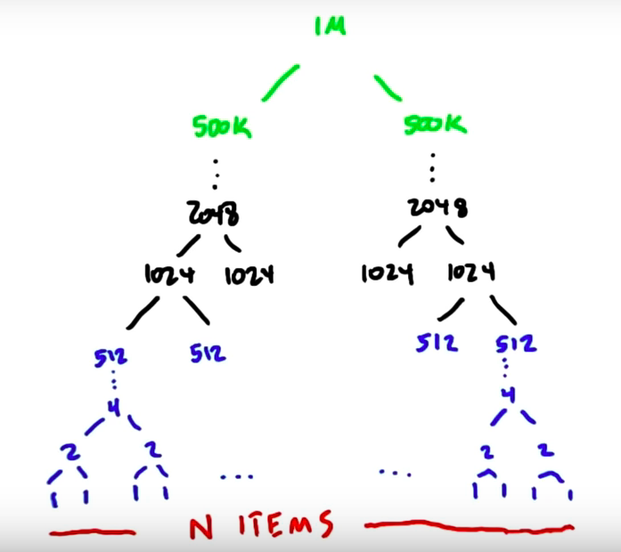

# Lesson 4
## Fundamental GPU algorithms part 2:
### Applications of *scan* and sorting on the GPU

## Recap of scan

*Scan* can be used for running total/running sum but also other binary associative operations like Min, Max and most logical operations.

In the best GPU scan implementations:

1. Amount of work $\mathcal O(n)$
2. Amount of steps $\mathcal O(\log n)$

## Compact (filter)
*Compact the large input set into a smaller set.*

Examples:

1. From a large amount of students, filter out students that scored higher than a certain grade.
2. In computer graphics filter out a set of objects from a larger group of objects that currently needs to be drawn onto the screen.
3. Filter out specific cards from a hand of cards


Often a dense output is preferable. To understand why let's look at an example: Filter out 13 diamonds from 52 cards

#### Sparse approach
```
if (card.isDiamond()) {
	computeCard();
}
```
Launches 52 threads of which 39 will be idle.
#### Dense approach
```
cc = compact(cards, isDiamond());

map(cc, computeCard());
```
Launches 52 threads for the *compact* but only 13 threads for the `computeCard()`. Especially when `computeCard()` is expensive it is worth not having the other 39 threads idle.

**Compact is most useful when we compact away a *large* number of elements and the computation on each remaining element is *expensive*.**

How do we implement the *compact* operation?
**Exclusive-sum-scan!**


Four steps (efficient implementation might combine some of these):

1. Run a *predicate* on the elements
2. Create a *scan-in* array: True -> 1, False -> 0
3. *Exclusive-sum-scan* on *scan-in* outputs the scatter addresses for compact array
4. Scatter input into output using these addresses if the predicate is true


Scatter is faster because there are fewer memory operations!

Generally speaking *compact* allocates exactly 1 item in the output for each true input and 0 items in the output for each false input.


We could also do a *compact-like* operation that computes the number of output items dynamically for each input item.


So if the number of outputs per input is calculated dynamically, how much memory do you allocate?

We could allocate the maximum space per input element in an intermediate array and then compact the result. However, this is wasteful in space and would require that we scan the large intermediate array.

A better way to do this would be to input not whether the triangle has an output (pred = 1) but the number of outputs it has and then perform the scan.


## Segmented scan

When you have to do many small scans, there are two options:

1. Launch a kernel for each small scan indepently
2. Combine as segments into large array and to a *segmented scan*. 

Second options is often better because when you launch you want it to have a lot of work to do.

We now need a special scan operator that scans each of the segments indepently.

To indicate where segments begin, we might use a second array that contains 1s for segment heads and 0s for non segment heads.


**TODO:** Course does not implement this, do it myself

## Sparse matrices

*Compressed sparse row (CSR)* representation is useful when you have large matrices with many zeros.

Instead of one matrix you have three vectors:

1. Value vector represents all non-zero data
2. Column vector represents the columns each of the data came from
3. Row-PTR contains the indices where the rows begin


## Matirx multiplication of sparse matrices


Substantially more efficient for a real matrix that has a significant amount of 0's.

It's actually easier to do the scan backwards because then we can use RowPtr to gather the results. We could also do a segmented reduce which is slightly more efficient than segmented scan.

## Sort

1. Lot's of serial algorithms!
2. Fewer parallel algorithms :(

We want parallel algorithms that ...

1. ... keep the hardware busy (lots of threads busy at same time).
2. ... limit branch divergence.
3. ... prefer coalesce memory access.

Serial sorting algorithms ...

1. ... tend to be moving little bits of memory at a time.
2. ... have "very branchy" code.

### Odd-even Sort (Brick sort) / parallel version of *Bubble sort*


Red (odd) elements first pair with element on the left, then with element on the right, then left, ... Swap when necessary.

Serial implementation: Best case runtime $\mathcal O(n)$, average and worst case runtime $\mathcal O(n^2)$. So runtime of parallel version is better than the average serial runtime.

### Merge Sort
Tree that represents the merge sort:

There are $\log(n)$ steps and at each level we touch all $n$ elements. The total work therefore is $\mathcal O(n\log(n))$.

The problem starts of with many tiny parallel problems. Eventually, we end up with only one large element to solve (final merge).

What we do at each level of the computation is the same:

Merge two lists of sorted elements into one.

We start with n lists of *sorted* one-element lists. Do n/2 merges and have n/2 *sorted* two-element lists. Do n/4 merges and have n/4 *sorted* four-element lists.

The hard part about implementing this on GPU is that the number and size of the merges differs greatly between the levels.

Let's devide this into three stages:

1. stage (blue): many tasks, each task small amount of work. We therefore assign one merge to one thread which can perform each individual merge using a serial algorithm. For better performance use coalesce memory access by using shared memory as a staging area to read from and write to. In reality for the blue stage one would not even use merge sort. More later...
2. stage (black): Lots of small sorted blocks and we need to merge these small sorted blocks together. For these intermediate merges we could assign one merge to one threadblock.

How do we merge two sorted blocks?