# Lesson 5 - Optimizing GPU Programs

## Principles of efficient GPU programming

1. Maximize arithmetic intensity (amount of math operations we do for the amount of time we spend on memory access)
2. Minimize time spent on memory operations
3. *Coalesce* global memory access
4. Avoid thread divergence
5. Move frequently accessed memory to the fast shared memory

## Levels of optimization

1. Picking good algorithms
2. Basic prinicples for efficiency
3. Architecture-specific detailed optimizations
4. "Bit-twiddling" micro-optimization at the instruction level

Examples for those levels on **CPU**:

1. Use mergesort O(n log n) instead of insertion sort O(n^2)
2. Write cache-aware code, i.e. traverse rows vs cols
3. Block for the L1 cache; vector registers SSE, AVX (?) These types of optimization are a *lot* more important in CPU programming compared to GPU programming.

Examples for those levels on **GPU**:

1. On a CPU heap-sort often is slightly faster than merge-sort (both O(n log n)). On the GPU the heap is difficult to parallelize => Pick fundamentally parallel algorithms!
2. **Coalesce** global memory access and use **shared** memory.
3. Optimizing *bank conflicts* in shared memory and optimizing *registers*.

## APOD - Systematic optimization process

-> Analyse -> Parallelize -> Optimize -> Deploy -> (get real life feedback)

1. Analyze: Where can the application benefit from parallelism and by how much.
2. Parallelize: Pick an approach (existing libraries, directives such as OpenMP and OpenACC, programming languages for GPU). Then, pick the right algorithm
3. Profile-driven optimization (measure the performance, adapt the algorithm until you have something that performs well)
4. Deploy early and frequently: Don't optimize in a vacuum. Depley it and get real life feedback. Even 2 or 4 times speedup is useful to customers, don't wait until you have 20 times speedup on something that might not be a bottleneck in real life.

## Weak vs strong Scaling

1. **Weak scaling:** Run a larger problem (or more problems) in same time
2. **Strong scaling:** Run a problem faster (at the same size)

## Understanding Hotspots
Don't rely in intuiton!

Run a profiler:

1. gprop
2. vtune
3. VerySleepy

### Andahls Law
Total speedup from parallelization is limited by portion of time spent doing some thing to be parallelized

max speedup = 1 / (1 - p), where p is % of parallelizable time

Example: When 50% of time is spent on things that are parallelizable, the max speedup is x2!

Remeber: Often, when a hotspot is ported to GPU, it is so much faster that it is no longer a bottleneck and you have to look at other hotspots that are now more important than further optimizing the first hotspot.

## Parallelize
### Example: Matrix transpose
Goal: Switch every element (i,j) with element (j,i).

Matrix is layed out in row major order:

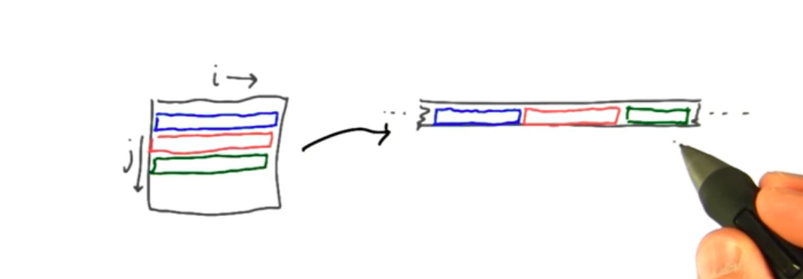

Serial implementation:

```
void transposeCPU(float in[], float out[]) {
	for (int j = 0; j < N; j++) {
		for (int i = 0; i < N; i++) {
			out[j + i * N] = [i + j * N];  // row major order  		
		}	
	}
}
```

The file `transpose.cu` contains several parallel implementations:

1. **Serial:** 1 thread on GPU transposes a 1024x1024 matrix in 144.368 ms (0.024% of theoretical peakbandwidth). This is a long time but might be completely fine if done only once in the code or on a very small matrix.
2. **Parallel per row:** One thread per row, 1.23155 ms (2.8% of theoretical peak bandwidth)
3. **Parallel per element:** One thread per element, in a 32x32 grid of 32x32 thread blocks. 0.067168 ms (52% of theoretical peak bandwidth)

At this point, is there something else we can do? Usually you can optimize the compute and the memory access. Transposing costs almost no compute, so let's optimize memory access:

From `deviceQuery.cpp` find out the memory clock:

* Memory Clock rate:                             5505 Mhz (clocks/s)
* Memory Bus Width:                              352-bit = 44 bytes/clock

The theoretical peak bandwidth therefore is 242 GB/s!

Good rule of thumb:

Using:

* 40-60% of memory bandwidth => okay
* 60-75% of memory bandwidth => good
* > 75% of memory bandwidth => excellent

So how well is our code doing?

Reading and writing 1024x1024 elemets of 4 bytes in 0.067168 ms gives a bandwidth of 125 GB/s. This is 51% of theoretical peak bandwidth.

So we can probably do better!

Whenever you see really low DRAM utilization or really low percentage bandwidth, your first guess should be **coalescing**.

The GPU is always accessing DRAM (global memory) in pretty large chunks, 32 or 128 bytes at a time.

We need **the fewest total memory transactions when threads in a warp access contiguous adjacent memory locations**.

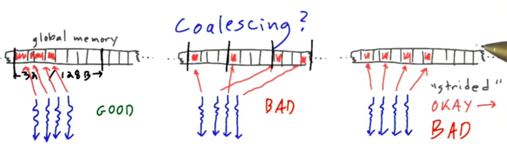

**Left:** Example of good coalescing. Every thread either reading or writing an adjacent memory location. 

**Middle:** Random access pattern: Threads in the warp are reading or writing completely random memory locations. You get poor coalescing. If accesses are spread out all over memory the total number of chunks of memory that we have to read (vertical black lines) could be as large as the number of threads in the warp.

**Right:** Strided access pattern: Threads access memory location that is a function of their thread Id times some stride. Strided accesses range from being "okay" to "bad". Stride 2 doubles the number of memory transactions (halfing the quality of the coalescing). If the stride between elements is large enough every thread in the warp is accessing a different 32 or 128 byte chunk of memory => bad behaviour.

Let's look at our example kernel *Parallel per element*:

```
int i = threadIdx.x + blockIdx.x * blockDim.x;
int j = threadIdx.y + blockIdx.y * blockDim.y;

// one thread per element
out[j + i * N] = xin[i + j * N];
```

**Reading:** Threads with adjacent thread idx x are reading adjacent values of the input matrix. This is exactly what we want, this is good coalescing.

**Writing:** Threads with adjacent values of i are writing to places separated in memory by N. This is bad coalescing and the root of our problem.

**Most good GPU codes are memory limited**

So, always start by measuring your achieved bandwidth to see if you are using memory efficiently. If not, ask yourself why not!

Calculating the memory bandwidth by hand is nice but there are tools that do this for us. Use nSignt Eclipse on Mac or Linux or `nvvp` (Nvidia visual profiler). Look at *Global memory load efficiency* and *global memory store efficiency*.

The numbers mean: Of all the bytes that we fetched with each memory transaction, how many of them are actually useful?

The results for our latest kernel are 100% (fully coalesce access) and 12.5%, respectively.

We need to achieve a higher bandwidth while writing the output to the matrix.

## Tiling

* **Problem:** Coalesced reads, scattered writes
* **Goal:** Coalesce reads and coalesced writes

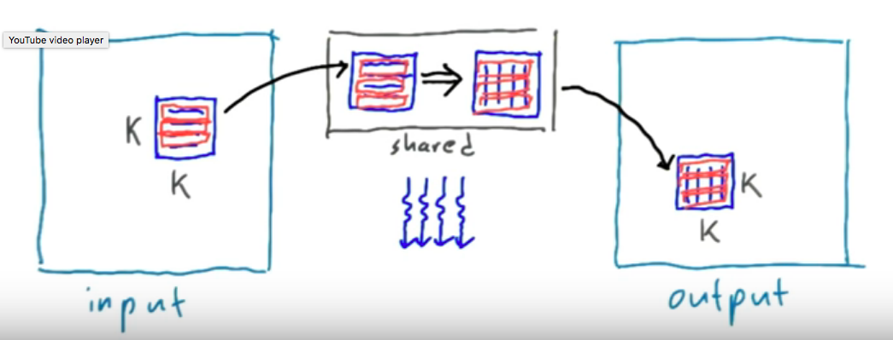

The idea is: We take a tile of the input matrix at a time, transpose it, and copy it in its transposed location in the output matrix. This is the job of a single thread block using shared memory. In shared memory you don't pay that tremendous cost for scattered write or read.

Notice the read rows: Each warp will copy out a chunk of K=32 elements at a time into shared memory. And since all 32 threads in that warp are reading and writing in adjacent memory locations, you get good coalescing. Same while writing in the output matrix.

This gives the following improvement:

```
Transpose_parallel_per_element: 0.077856 ms, Success
Transpose_parallel_per_element_tiled: 0.053984 ms, Success
```

Interestingly the lesson video reports almost no improvement. Maybe because of weaker GPU? 
Video says that *Global memory load efficiency* and *global memory store efficiency* are both at 100% now but that DRAM utilization is lower than before. Why is that?

### What makes the GPU fast?

1. Massively parallel
2. Extremely high-bandwidth memory to feed all those processors

Goal: you have to try to utilize all the available memory bandwidth, hence focusing on global memory coalescing and DRAM utilization etc.

What do we mean by using all the available memory bandwidth?

#### Little's law

**Number of bytes delivered = Average latency of each transaction * bandwidth**

Here we mean *useful* bytes delivered, thus ensuring good coalescing.

What can we do to improve bandwidth?

1. Increase the number of useful bytes delivered
2. Decrease the latency (time between transactions)

**On the GPU:**

There is a minimum latency to get memory form DRAM or write it there. A typical 2GHz chip today has a clock cylce of ~0.5ns. Light doesn't travel very far in that time, neither does electricity, especially in the tiny wires found in computers. Usually takes 100's of clock cycles for information to get from the board through the wires to the chip.

So threads wait a lot of time for their information to arrive from global memory and don't do anything useful during those clock cycles.

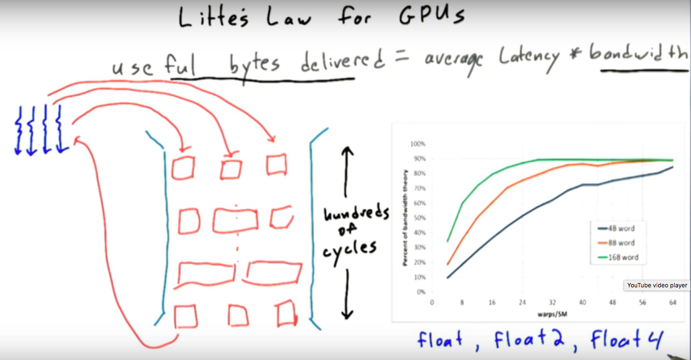

Think of the memory system as a pipe. The pipe is very deep (several hundred clock cycles that it takes to request and receive information from global memory). The pipe is also very wide as it is designed to handle requests from many, many SMs at the same time.

So if you have only a few threads using that pipe, the pipe is mostly empty and not many bytes are being delivered while the pipe could handle more threads requesting memory.

Little's law: If you cant improve the average latency, improve the bandwidth by having more threads issuing memory transactions to get more useful bytes delivered!


Plot: three curves copy info from one matrix to another in three different styles (4 byte, 8 byte and 16 byte types).

So if we used one thread to move not 4 bytes from memory but 4 x 4 bytes and do a transpose on that, we would improve from the blue to the green curve. This would make *our memory transactions wider in the pipe*, however, this makes the code very guly and it really is a micro-optimization. 

So instead of making each transaction wider in the pipe, do more "narrow" transactions by using more threads.

1. Kernel: one thread per matrix => suffers from too few transactions
2. Kernel: one thread per row => probably suffers from too few transactions
3. Kernel: 1 thread per element => enough transactions, suffered from strided write
4. Kernel: 1 thread per element => enough transactions and profits from coalesce read and write.

So if the number of useful bytes delivered per transaction is not the problem in the latest kernel, it must the average latency. There must be something that keeps the time between transactions "in our pipe" larget than it has to be.

The problem is the `__syncthreads()` in our latest kernel! One threadblock has 32x32 threads. And most of the time they do nothing but waiting for the other 1023 kernels to finish reading from memory!!! The more threads in a block, the more time they spend wating for the other threads to reach this barrier on average.

What can we do to reduce the average wait time per thread? **Reduce the number of threads in a block and increase the number of threadblocks per SM**. Every thread block runs on a single SM but every SM can hold more than one thread block. In this case, the threads in one thread block can be working while the threads in another thread block are waiting at the sync barrier.

What limits the number of threadblocks a single SM can run?

### Occupancy
**Number of threads that is running vs number of threads that could be running.**

Each SM has a limited number of:

1. thread blocks: 8
2. threads: 2048 (GTX 1080 Ti)
3. registers for all threads: 65536
4. bytes of shared memory: 49152 bytes

Find with `deviceQuery`.

If your SM has a maximum of 48k of shared memory and a kernel requires 16k => maximum 3 blocks/SM

If your SM has maximum of 2048 threads and your block has 1024 threads => 2 blocks/SM

The latest kernel we wrote uses a gridsize of (32,32,1) with a block size of (32,32,1), uses 7 registers per thread, and uses 4kb of shared memory per block.

Given the GPUs statistics from `deviceQuery`, how many threads blocks per SM and how many threads per SM can we run?


2. 1024 threads used by kernel, maximum of 2048 threads per SM, limits us to 2 thread blocks
3. Kernel uses 7168 registers but limit is 65k, no problem, restricts us to 9 thread blocks per SM
4. Kernel requests 4kb of shared memory, 48k is the maximum, limits us to 12 thread blocks per SM
5. Maximum of 8 thread blocks per SM is also not the limit.

Which resource is preventing us from running more?

**We are limited to running 2 thread blocks per SM**.

My GPU and the GPU of the instructor: 2048 max threads running in two thread blocks with a max of 2048 threads per SM => 100% occupancy

Fermi GPU used for the Udacity course has a maximum of 1536 threads per SM so an occupancy of only 66%.

There is a useful spreadsheet in the CUDA toolkit installation called CUDA occupancy calculator that helps you determine how well your kernels will do in terms of occupancy depending on the GPU.

How can you affect *occupancy*?

1. Control amount of shared memory, e.g. tile size
2. Change nmber of threads per block

However, this is always a tradeoff. Reducing the tile size/block size might mean higher occupancy and less time waiting at sync barriers but it also might mean sacrificing on coalesce memory access (what the tiling was introduced for). 


#### Next kernel
Reduce the tile size to 16x16.
Each thread has to wait for fewer threads at the sync barrier.
Should decrease the latency of memory operations and thus with Little's law should increase the total bandwidth.

```
Transpose_serial: 144.37 ms, Success
Transpose_parallel_per_row: 1.1119 ms, Success
Transpose_parallel_per_element: 0.060736 ms, Success 
(bad coalescing on write but might be fast enough to deploy, might not be the bottleneck anymore)

If still the bottleneck, you might want to analyze and parallelize further:
Transpose_parallel_per_element_tiled: 0.040256 ms, Success
(Still not good DRAM utilization because too many threads waiting at barriers)

Transpose_parallel_per_element_tiled16: 0.0288 ms, Success
```

(Remember: all this is happening in context of APOD [analyze, parallelize, otimize, deploy]

Statistics with the Udacity GPUs on AWS:

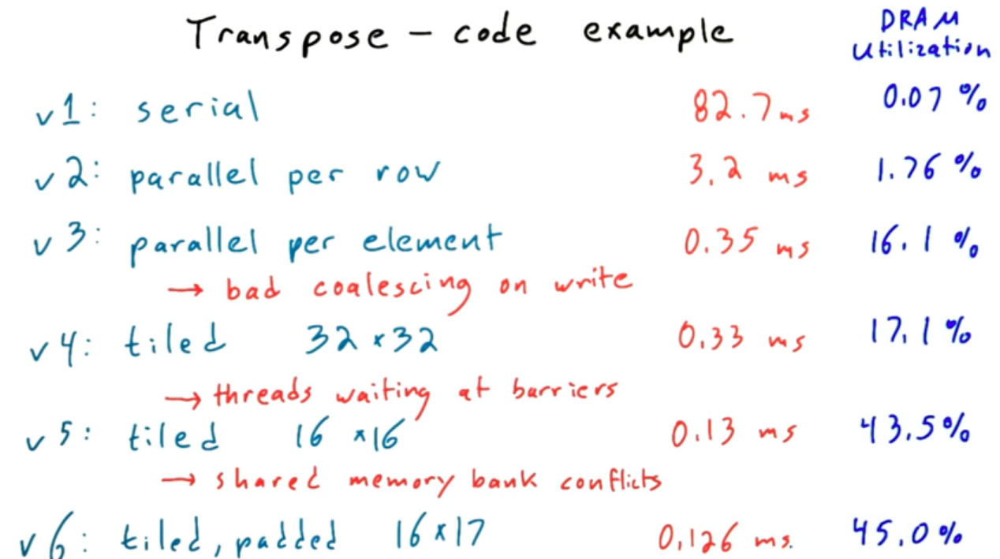

If you want to optimize further, reduce *shared memory bank conflicts* by reserving slightly more shared memory than is actually used. Doesn't give that much speedup though. 

Note: I tried this, gives no improvement on my GPU!

Check out **CUDA C Best Practices Guide**


## Optimizing compute performance
Until now, we only discussed optimizing memory access as it is the bottleneck for many GPU applications. Sometimes the bottleneck is *compute performance* though.

Two simple guidelines:

1. Minimize **time waiting at barriers** (we already saw this => reduce number of threads in thread blockl)
2. Minimize **thread divergence**

### Minimizing thread divergence

**Warp**: A set of threads (32 for Nvidia) that execute the same instruction at a time

**SIMD**: Single Instruction, Multiple Data. All modern CPUs use vector instructions (called SSE or AVX in Intel CPUs), allow the CPU to execute the same instruction on multiple pieces of data at once.

If using SSE instructions, in a single clock cycle you are affecting 4 pieces of data. On AVX it could be 8 pieces of data => vector registers represent a huge amount of compuational horsepower. If you don't use them, you are missing the most of the power of your processor.

**SIMT**: Single Instruction, Multiple Threads.

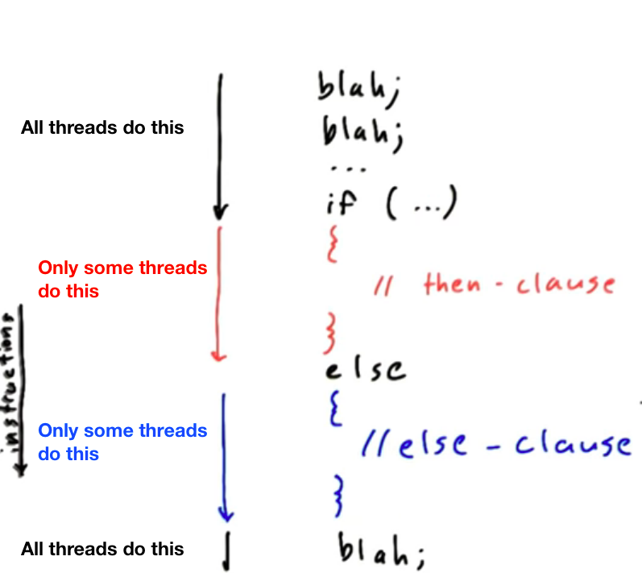

Left: warp that takes if clause; right: warp that takes else clause. Threads in the warps execute their instructions in lock step.

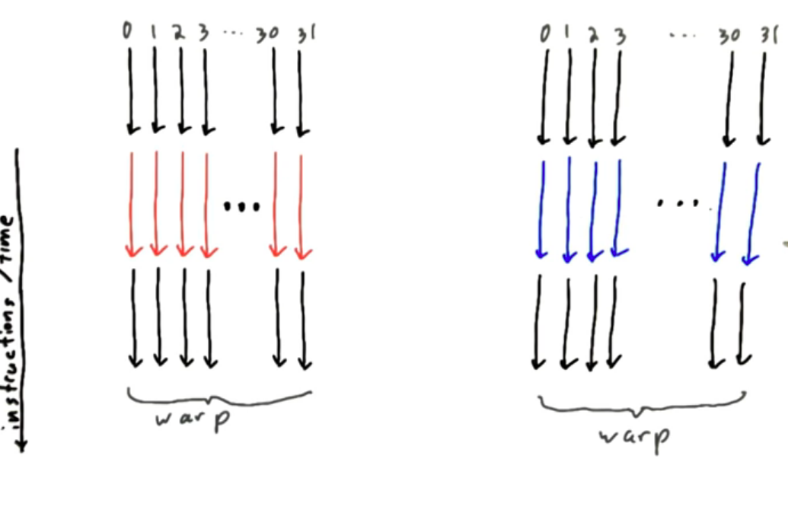


Thread divergence within a warp:
Threads in a warp can do only **one thing at a time**. Red and blue after each other, hardware deactivates some threads in each thread! Time is lost!

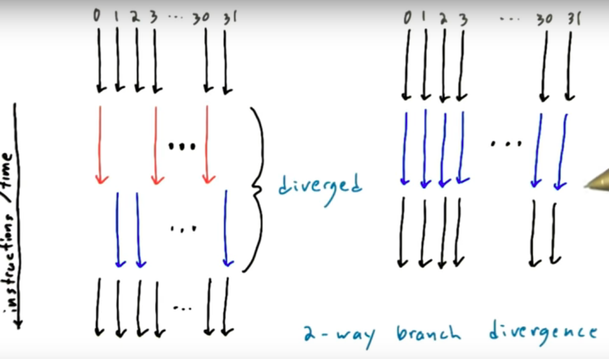

Max slowdown: 32-way branch divergence (because of number of threads in warp). Could be achieved by a switch statement with 32 cases. Runs 32 times slower than if all threads in the warp switch to the same case.

Calculate slowdown for the following switch statements and kernel launches:

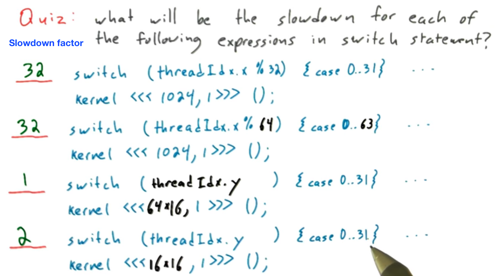
kernel<<<64x16>>> means that there will be 2 warps for threadIdx.y = 1 => no thread divergence within a warp
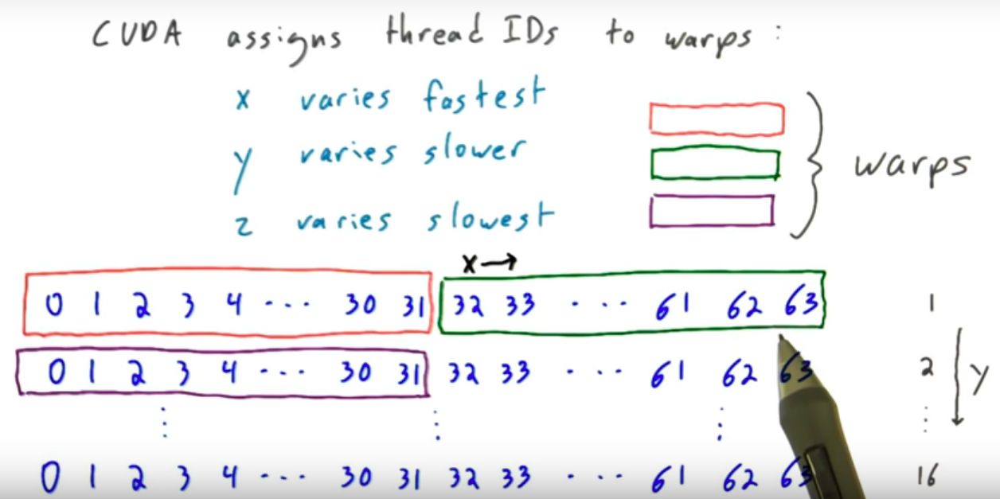
kernel<<<16x16>>> means that a warp will comprise two indices threadIdx.y => 2-way thread divergence
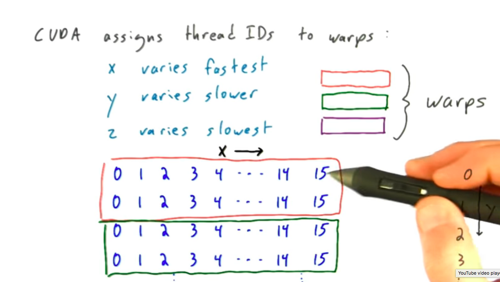

Some more examples:

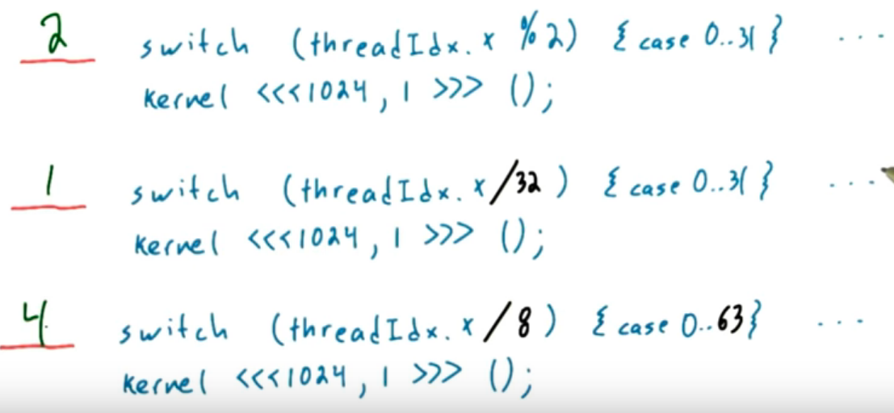

### Loops are another kind of branch
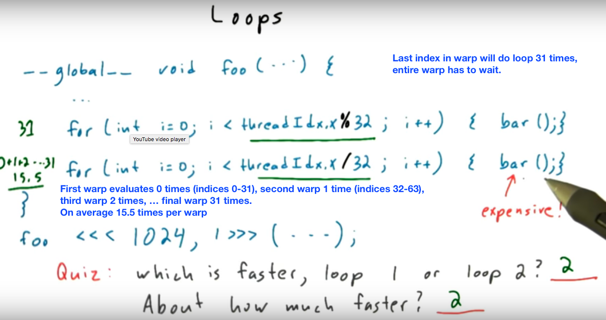

