# Lesson 6
## N-body computation
**N bodies that all exert a foce on each other.**

All-pairs n-body: each object computes the forces on it from each other object. O(n^2)

By approximating that distant objects are grouped together and considered as a single object time complexity can be brought down to O(n log n) [Tree methods, Barnes-Hut] or even O(n) [Fast multipole method].

We do *all-pairs* now:


(elements on x and y axis are of course the same elements)

N source elements, n destination elements.

We must fetch a source element x for each compuation for every destination element. And for a particular destination element x, we have to fetch all n source elements. If particles don't exert a force on themselves, this yields 2 n - 2 global memory accesses, n-1 as source element and n-1 as destination element. This is very expensive!!!

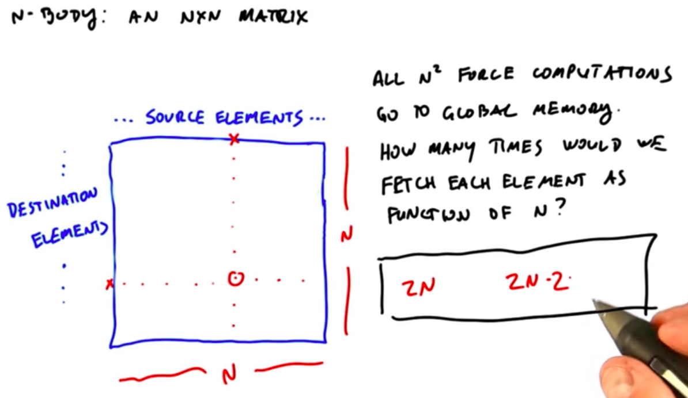

We should try to consume less global memory bandwidth

We divide the matrix into square chunks called *tiles*. Tiles are computed in parallel and then the forces are added horizontally across tiles to get the total force on the *destination elements*

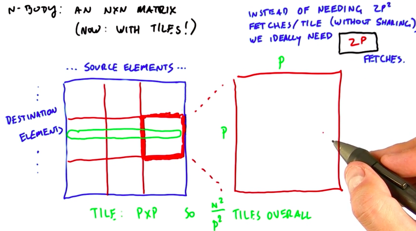

Each tile computes partial results for *P* destination elements/threads. These partial results are the contribution to the total force of the *p* source elements in that tile.

For each of the tiles we have to add the partial results horizontally in a row to get the total force on each destination element.

If we run each tile with *p^2* threads, we can calculate all forces in that tile at once. This is good. However, there are downsided to this approach:

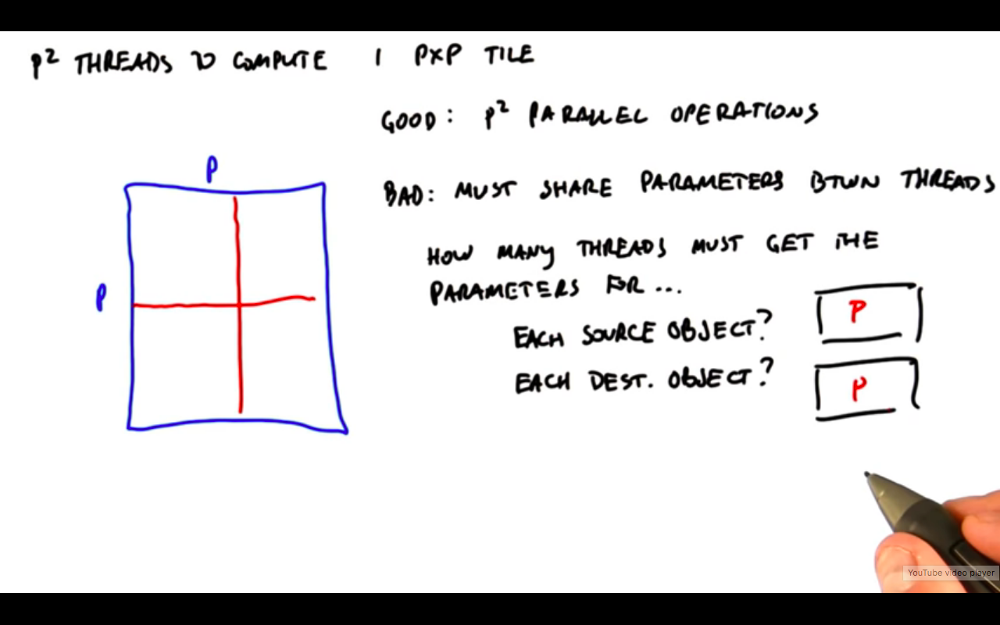

We are fetching the parameters for each source and destination object once but we have to distribute this information across *p* threads, respectively.

1. We could store this information in stored memory once. Reading from shared memory is slower than reading from local memory though.
2. Or we have to replicate that information in each threads local memory but this wastes space and reduces the number of threads we can have in a single thread block (remember, max amount of space per thread block).

The second downside is that we have to communicate between threads to sum up the forces.

#### There is a better way to compute a tile: use p threads inestead of pxp threads on a pxp tile.

One thread corresponds to one destination object and is responsible for applying the force of all p source objects to that one destination object.

```
__device__ float3
tile_calculation(Params myParams, float3 force) {
	int i;
	extern __shared__ Params[] sourceParams;
	
	for (int i = 0; i < blockDim.x; i++) {
		force += interaction(myParams, sourceParams[i]);
	}
	return force;
}
```

`myParams` are associated with the current thread's destination element. Could be your position and mass or your charge. `float3 force` is the accumulated force on this object so far.

We store the parameters for the 
*p* source objects in shared memory.

So the source elements' parameters still need to be shared across all *p* threads but we **do not have to share the destination elements' parameters* since one thread is responsible for all forces on one destination element. That destination element's information can be directly loaded in that thread's local storage.

In addition, we do not have to communicate between threads to sum up forces and the accumulated force on that destination object will be calculatedin local memory.

**This second approach has actually reduced the amount of parallelism but it is still faster if the number of particles is so large that the GPU can still be kept busy.*

Why is this better?

**Fewer threads and more work per thread. Converted communication between threads to communication within a thread. Remember, maximize arithmetic intensity and minimize memory accesses.**

**Communication between thread local storage is faster than communication between threads within shared memory.**

We load each source object's parameters once per tile (think vertically). Larger tiles means fewer tiles, thus fewer loads of each source object's parameters. Larger *p* thus means less total main memory bandwith.

If *p* is too big, however, we can't use shared memory to share a source object's parameters across all threads. Check how much shared memory you can have per thread block on your GPU and figure out how many source element's with parameters fit in there. 

Also make sure that you have at least as many thread blocks as SMs or some SMs are idle. Defenitely make sure that you kepp all SMs on your machine busy.

If you need maximum performance, tune the size of the tiles carefully (and watch the video "Determining the size of the tiles" again).

### Summary - *all-pairs N-body*

1. Brute force, simple, high performance
2. Big idea: tradeoff between 1) maximizing parallelism and 2) maximizing work per thread yielding more efficient communication within a single thread. Often this is the right thing to do.

## Sparse Matrix Vector Multiplication

This is one of the most important operations in all of computing because many interesting matrices are *sparse* (have many zeros).

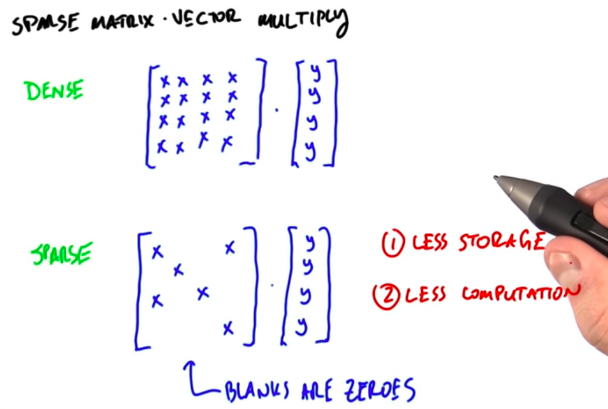

**Question we want to answer to get this to run efficiently: *what is the role of a thread*.**

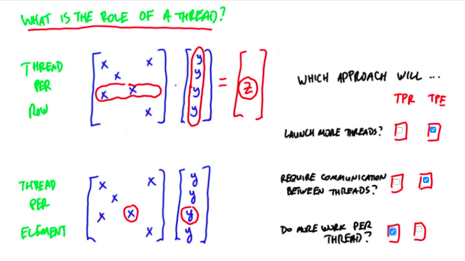

1. Top: thread multiplies row with entire vector
2. Bottom: thread multiplies one field of the matrix with the corresponding field in the vector. This is a partial product and threads need to communicate with each other to sum up the partial products (segmented scan, see unit 4).

Which is better? **Depends!**

### Thread per row approach

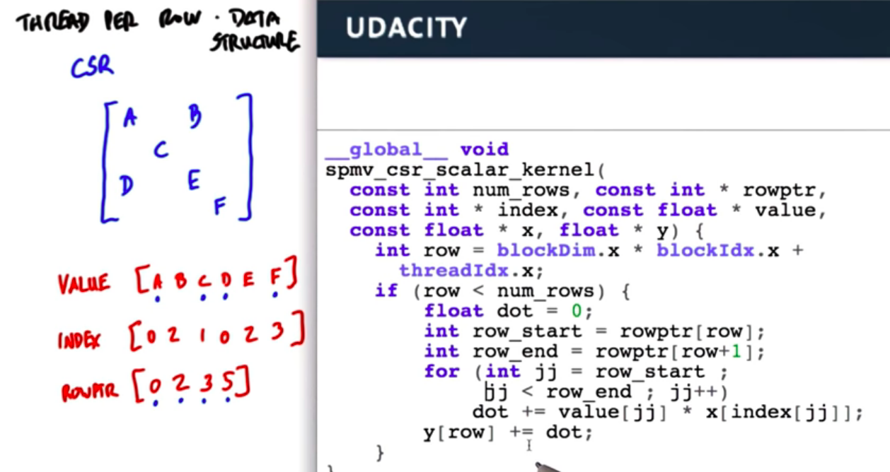

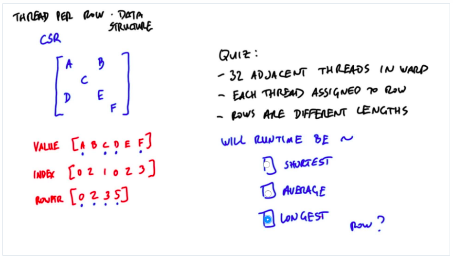

**Load imbalance:**

Eventually the threads assigned to short rows will run out of work while the other threads in the warp are still working.

**This is very efficient if all rows approx have the same number of elements. It is very inefficient if there are very short rows and very long rows in the same warp.**

### Thread per element approach

Let's think of an approach that is more efficient on matrices with varying numbers of non-zero elements per row.

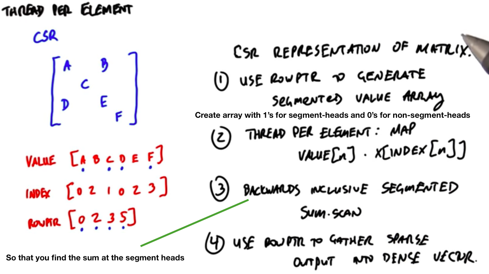

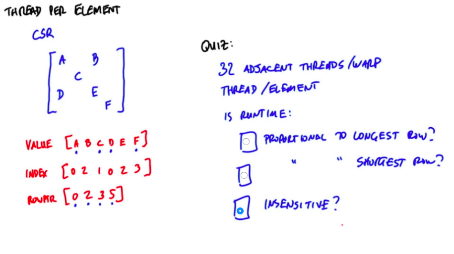

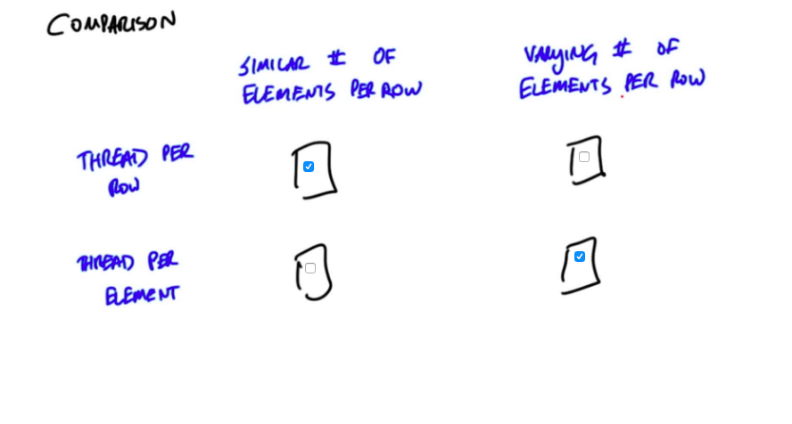

If all rows have approx same number of non-zero elements, *thread-per-row* is ~3 times faster. All partial products are accumulated within a single thread, thus communicate through registers, no communication between threads at all.

With *thread-per-element* the segmented scan on the other hand requires communication between threads to sum up the partial products. That communication is expensive.

So which of those two methods do we choose? We combine them!

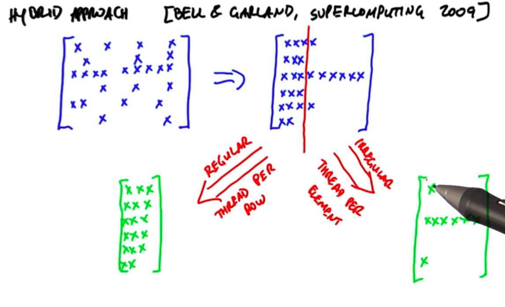

Only remaining question: where do we draw the line?

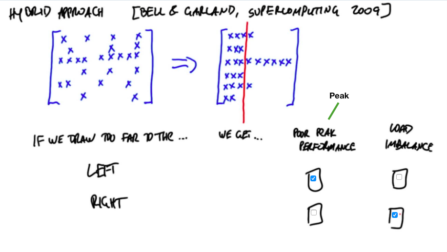

Since *thread-per-row* is three times faster, a good rule of thumb is to draw the line where 1/3 of rows still have non-zero elements.

This approach is called `hybrid` in NVIDIA cuSPARSE (sparse matrix library).


#### Big picture

1. Keep your threads busy. Fine grain load imbalance is a performance killer because your threads are sitting idle.
2. Closer communication is cheaper. Communicating through registers is cheaper than communicating through shared memory.