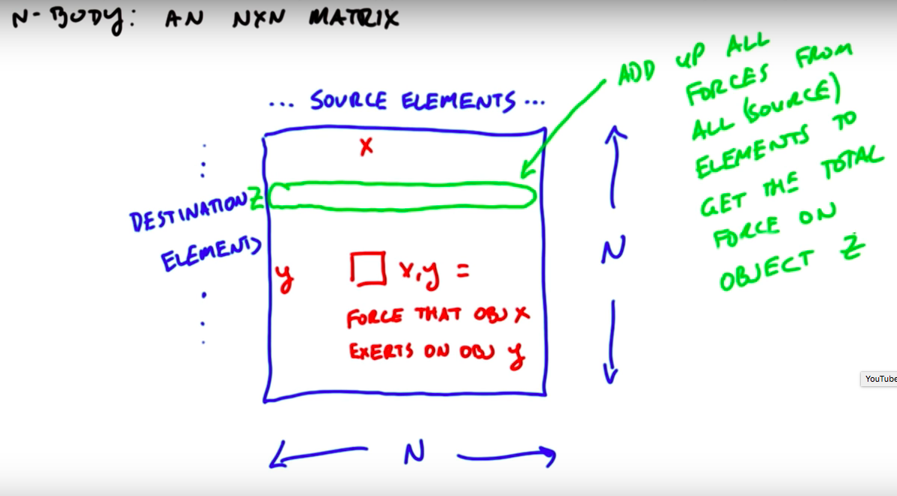

# Lesson 6
## N-body computation
**N bodies that all exert a foce on each other.**

All-pairs n-body: each object computes the forces on it from each other object. O(n^2)

By approximating that distant objects are grouped together and considered as a single object time complexity can be brought down to O(n log n) [Tree methods, Barnes-Hut] or even O(n) [Fast multipole method].

We do *all-pairs* now:

(elements on x and y axis are of course the same elements)

N source elements, n destination elements.

We must fetch a source element x for each compuation for every destination element. And for a particular destination element x, we have to fetch all n source elements. If particles don't exert a force on themselves, this yields 2 n - 2 global memory accesses. This is very expensive!!!

We should try to consume less global memory bandwidth

We divide the matrix into square chunks called *tiles*.
