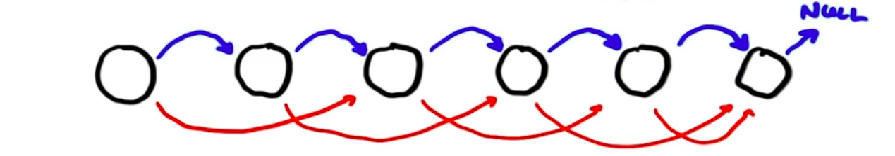
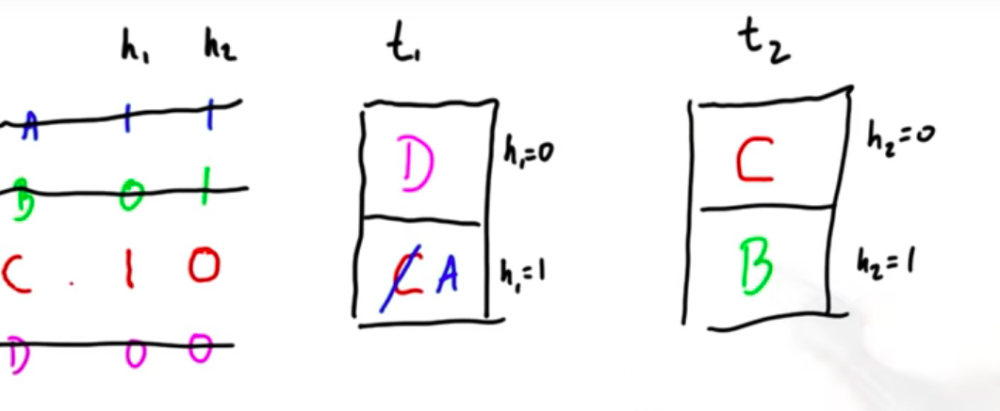

# Lesson 6 Part B - Parallel Computing Patterns

## BFS 

The problem with the algorithm from the previous lesson is that we visit every edge again and again but set  a depth only once for every vertex. Evey node is touched on every iteration.

It would be much better if we could visit every edge once when it is ready to process.

The CPU algorithm is much more work efficient because it maintains a frontier which marks the boundary between visited nodes and unvisited ones.


### Duane Merrill 2012


(e=edges, v=vertices)

Note that node #2 does not have any outgoing edges, hence no neighbors are listed in array C corresponding to node #2. Also, in array R, both R[2] = 5 and R[3] = 5. This is how we would know, just by reading the data structure, that node #2 has no outgoing edges, and the value C[5] = 4 corresponds to node #3 (meaning that node 3 has an outgoing edge to node #4).


Assume that we are one step into BFS and the frontier is "3" and "1".

1. Step: For every node on the frontier, find its starting index in array C.
2. Calculate the number of neighbours for every node on the frontier using array R: `R[v+1]-R[v]` (gives 3 and 1)
3. Allocate space to store the new frontier. Each node needs to know where in that array it might copy its edge list. Operation is called *allocate*, which is based on scan; we just scan the number of neighbours. In our example we would begin with the array `in = [3,1]` because vertex 1 has 3 neighbours and vertex 3 has 1 neighbour. We scan this array with an exclusive sum scan and get `out = [0,3]`. Node 1 starts to write its neighbours at offset `0`, Node 3 starts to write its neighbours at offset `3`.
4. Copy each block of node edges list to this array.
5. Check in array D for nodes that have already been visited (additional predicate array). This applies to the 0. So the array `[0,2,4,4]` has to be compacted into `[2,4,4]`. The 4 will be visited twice in the next iteration. That is wasteful. Check the paper for solutions to this.


#### Summary
**Big idea:** The basic step is a *sparse copy*. We start with a frontier, look up the adjacency list for the vertices in that frontier. Then we copy them in a contiguous block to make the next frontier. Repeat.

=> linear work, more than 3 billion vertices per second

Initialize: set starting node's depth = 0. Set starting frontier = neighbours of starting node.


2. Frontier: find starting indices for neighbours. How many neighbours?
3. Allocate space for new frontier
4. Copy edge list to new array
5. Cull visited elements (and probably also mark the ones that are visited in this iteration/mark depth).

### Linked List
The linked list / linear chain graph is hard to parallelize.

If we do BFS here it is going to take n steps to get to end of graph.

What algorithm can find the end of the list for each node?

Assume that each node has a *next* pointer (const) and also a *chum* pointer (can be changed, initialized to point to self). At the end of the algorithm we want every *chum* pointer to point to the end of the linked list.

Naive approach: in every iteration, set the chum pointer to chum.next until we reach a node where next is NULL.




On each iteration, the length of the chum pointer is going to be one more than it was on the iteration before.


This gives us n^2 work. N processors working for n steps.

The serial algorithm can solve this problem with a time complexity of O(n).

The goal of parallel computing is to find an algorithm with the same work complexity as the serial algorithm but fewer steps. Sometimes this is not possible but we are willing to do more work if in return we get fewer steps.

The problem here is that we repeat a lot of work the nodes down the chain already did for us.


If we don't jump to chum.next but to chum.chum we only need log(n) steps! The work done is n log(n) but only log(n) steps... Awesome!

```
find_last_node(const int * next, int * chum) {
	int k = blockDim.x * blockIdx.x + threadIdx.x;

	// Initialize
	chum[k] = next[k];
	
	while((chum[k]!=NULL) && (chum[chum[k]!=NULL])) {
		chum[k] = chum[chum[k]];
	}
}
```

The course does not talk about **race condition** in this context. However, it probably is a good idea to use i.e. a double buffer or save `chum[chum[k]]` in a local variable, followd by a `__syncthreads()` barrier, and then write that local variable to `chum[k]`.

## List Ranking
* Input: Each node knows its successor, starting node
* Output: All nodes in order


A serial processor can do this in n steps. How can we do this in fewer steps on a parallel device?

For every node we compute the node that is 2, 4, 8, ..., number of nodes hops away.


Note: when filling i.e. the row *+8* you can do this with two hops from row *0* to row *+4*.

This takes O(n log n) work and O(logn n) steps, thus more work than serial but fewer steps.

In the second phase of the algorithm we do the following:


In the beginning only not starting node 0 is "awake". We launch n threads. Threads for nodes that are "asleep" return immediately.

The immediate successor (+1) for node 0 is five and the index in the result array will be 0 + 1 = 1.

In the next step 0 and 5 are awake. We now calculate the +2 successors for both of them ("awake them").


The +2 successor of 0 is two. Its outpos is 2. The +2 successor of 5 is 7, its outpos is 3.


In the end we use `outpos` to scatter the nodes into to right order.


This second phase takes O(log n) steps as well.

This algorithm is a good example for trading more work for fewer steps.


## Hash tables

Chaining is bad for parallelization. We have many items to put in the hash map or look up. One item per thread. Load imbalance if linked lists are not the same length. Since threads within a warp run in lock step, the runtime of a warp is completely dependent of the slowest lookup in that warp.


The second big problem with chaning is *contention during the construction process*.

We might have two threads that both want to put their item in the same bucket. They both have to update the same linked list. This means they have to synchronize, only one thread can update the bucket at any given time. => **Serialization, very bad!**

**Chaining is bad for parallel hash tables.**

### Cuckoo Hashing

Key ideas:

1. Multiple hash tables (not 1) and only one item per bucket, no chaining.
2. Multiple hash functions (! per hash table)

This example uses two hash tables and two hash functions but the method generalizes to more than two.

Procedure:

We try to put four elements into a cuckoo hash table consisting of two hash tables with two buckets each.

We start with "all items being alive". We try to put them all into t1.

A and C collide and B and D collide.


We choose arbitrarily, let's say C and D make it:


In the next step only A and B are "alive". They both want to be in h2 of t2. Let's say B makes it.


Now only A is alive. We go back to putting it in t1. But of course we know that this already failed once. This is why we take a second hash function h2.

A replaces C, C is now alive again:


Using h2 C get's put into the first bucket of t2.



And we are done.

Big picture: by kicking out items that are already in the hash table, we have a new set of items we can try with the second hash function. Hopefully they fit better than the old set.

We do this scheme until we have no items left.

However, this will not always succeed.

In reality we would stop after a certain number of iterations, choose new hash functions and try again.

Lookup is really simple. If you want to lookup item B, you calculate all the hash functions for it and lookup in all the tables. If you don't find it in any of the tables, it's not in the cuckoo hash table. This requires T lookups and T is constant => constant time lookup.

#### Implementation notes:

1. Constant time lookups - no divergence
2. Construction is simple and fast. (if small number of tems and done in shared memory, really fast; global memory: requires **atomic exchange** to overwrite and kick another item out, but still ok)


### Alternative

Sort your items and use binary search for lookup. *Sort* is fast on GPU and while hash tables are faster, it might still be worth considering. Sometimes brute force approach like sort + binary sort is a good approach on a GPU.

## Conclusion

Dense n-body: 

1. Minimize global memory bandwidth 
2. Reducing amount of parallelism by increasing the amount of work per thread might reduce your overall communication cost and hence, your overall runtime

Sparse matrix * vector

1. The right data structure can make a big difference
2. Reduce load imbalance
3. Keep gpu busy

BFS

1. Choose efficient algorithms
2. Irregular expansion/contraction: scan is the natural primitive to handle these operations


List ranking

1. Trade more work for fewer steps
2. Power of scan

Hash table

1. Choose parallel friendly data structure, linked list is a serial friendly data structure
