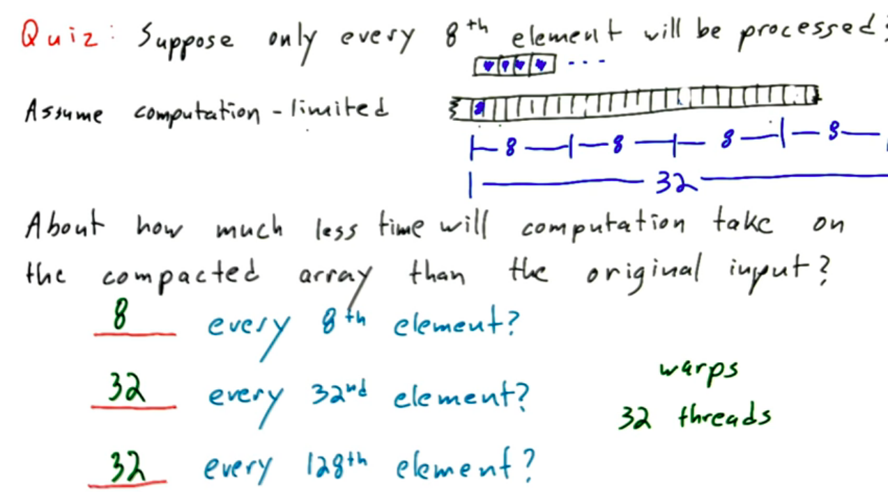
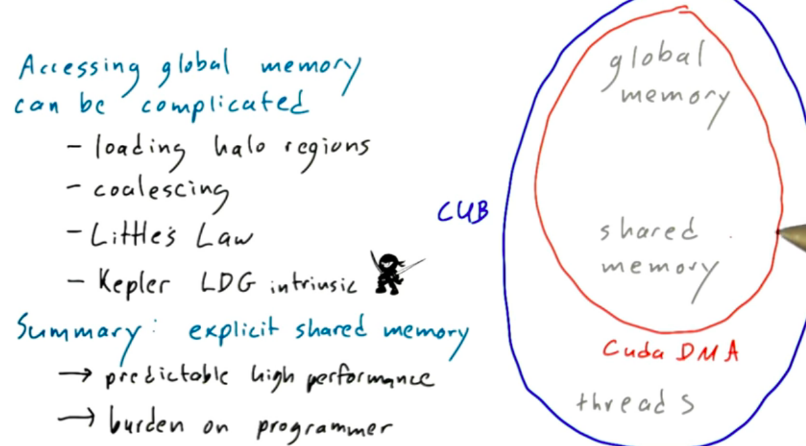

# Lesson 7

## Parallel Optimization Patterns

* Stratton et al. (Optimization and architecture effects in GPU computing and workload performance) InPar 2012. More readable version of same paper in IAAA computer 2012

They analyzed numerous GPU parallelized programs and extracted 7 basic techniques that come up over and over again:

1. **Data layout transformation:** 
	* Reorganize data layout for better global memory performance (coalescing). 
	* Burst utilization, i.e. Aos -> SoA (Array of structurs -> structure of arrays)
	* Partition camping, i.e. *Array of structures of tiled arrays (ASTA)*

	
	
	
2. **Scatter - to - gather transformation:**
	Several input elements give one resulting output element, i.e. for bluring or histograms:
	
	In *scatter*, the elements are assigned to input elements and each thread decides where to scatter them. 
	
	
	In *gather* the threads are assigned to output elements
	
	
	
	
	
	The second snippet runs much faster. The first is accessing more memory since it has to read the three output locations to increment them, also there is a race condition and you would need atomic add or syncbarriers to make this work.
	
	* Gatter: many overlapping reads
	* Scatter: many potentially conflicting overlapping writes

3. **Tiling:** Often many threads will have to access overlapping parts of a data structure. Stratton refers to *tiling* as buffering data into fast on-chip memory for repeated access.
	* Either implicit copy from global memory to on-chip memory (cache). Cache-blocking is problematic on GPUs, however, as the amount of cache is limited and the number of threads large. Might limit the number of concurrent threads!
	* Therefore better explicitly allocate fast shared memory


	Comparison:

	* global memory: 0.007168 ms 
	* shared memory: 0.005152 ms

4. **Privatization:** 
	
	* Threads sharing input: good
	* Threads sharing output: bad

	*Avoid common output for as long as possible.*

	Privatization takes some output data shared by multiple threads and duplicates it so that each thread can operate on their own private copy. Private copies are finally merged together.
	
	Histogram is a good example for this. You could have privitazid histograms per thread that are combined into *per-block* histogram that are finally merged into a global histogran. If there are many buckets, it's probably best to skip the *per-thread* privatized histogram.
	
5. **Binning/spatial data structures:** 
	*Reduce the amount of input that a thread has to look at for a given output.*

	We learned that it is often better to gather as opposed to scatter because you avoid atomics and sync barriers. However, sometimes it's is not obvious which input elements contribute to the thread's output element. Of course you could check all input elements for the given output element but that is too expensive.
	
	We have to optimize away most of the redundant work when checking all of the input elements.
	
	Binning is when you build a datastucture that maps output locations to the relevant input data. This works best when mapping a small subset of the input data to the output location.
	
	Stratton et al. called the creation of this data structure as binning. It often reflects sorting the inputs into bins that contain a region of space containing the relevant input elements.
	
	(Watch video accessible population for an example)
	
6. **Compaction:**

	*Avoid processing inactive inputs. Process on a sparse set of inputs.*

	Useful when you have a computation to perform on a set of elements but the exact indices of the elements that need computation are not known in advance. If most elements require computation, it's simplest to assign a thread to all elements and have each thread check whether they need to calculate something.
	
	If relatively few elements require the computation you waste a lot of storage on the output and a lot of threads are idle, which is especially bad if the compuation is expensive. 
	
	Compacting the elements means creating a dense array containing only active elements.
	
	
	Reason: 32 threads in a warp, the idle ones have to wait for the others to complete. If every 8th element is useful, that is only 4 per warp. If you would compact the input, a warp could do 8 times more useful work and other warps could already process other inputs. This would give you a speedup of x8. Same argument for 32.
	
	For "every 128th element" there is a sublety: a warp that does not contain an active element quickly returns and goes on to process other input. So you only pay a price for the warps that contain a single active element. Therefore compacting still gives you only a ~32 speedup.
	
7. **Regularization:**
	
	*Extract regular parallelism from irregular parallelism*
	
	* Reorganizing the input data to reduce load imbalance
	* Make sure that you don't have a single warp that has a thousand inputs to process while the other warps in the thread block have only a few.
	
	
	
	The first one is a good example where regularization might help. There is an average case of inputs a thread has to deal with. However, the outliers make all other threads in a warp wait. If you handle those with another algorithm/extra kernel/on CPU, the code will run much faster.
	
	If work load varies widly, it is very difficult to come up with a regularization strategy.
	
## Popular Libraries

### cuBLAS (Basic Linear Algebra Subroutines)

Go-to workhorse for scientists and engineers working with dense linear algebra (C, Fortran)

### cuFFT
1D, 2D, 3D FFT routines
	
### cuSPARSE
BLAS-like routines for sparse matrix formats
	
### cuRAND

Pseudo- and quasi-random generation routines

### NPP (Nvide Performance Primitives)

Low-level image processing primitives

### Magma
GPU + multicore CPU LAPACK routines (Linear Algebra for scientists/engineers)
	
### CULA
Eigensolvers, matrix factorizations & solvers

### ArrayFire
Framework for data-parallel array manipulation

### How to use libraries

If you already use CPU libraries:

1. Substitute library calls (exchange function calls for the CUDA versions)
2. Manage data locality (if you want to manipulate data in GPU, make sure it is already there `cudaMallo()`, `cudaMemcpy()`, `cublasAlloc()`, `cublasSetVector()`)
3. Rebuild and link to libraries `nvcc myobj.i -l cubas`

## CUDA C++ Programming Power Tools

Compared to other libraries discussed, these are not about solving a domain specific problem but rather a power-tool box enabling the programmer to build her/his own solutions.

### Thrust

Analogous to C++ STL (containers, iterators). *Thrust* provides a data parallel analog to the STL for CUDA and borrows cool stuff from *Boost*.

Allows *host code* to easily create and manipulate data on the GPU. Avoids having to write kernels in many cases.

The principal container abstraction is `thrust::device_vector` (can be resized dynamically like STL vector).

1. sort
2. scan
3. reduce
4. reduce-by-key
5. Add two vectors using `thrust::plus`
6. Apply user-defined transformation using functor
7. `thrust::device_vector` can wrap up CUDA device pointers. => You can "mix" thrust with your own kernels.

```
thrust::device_vector<float> X(3);

float result = thrust::reduce(X.begin(), X.end());

float max = thrust::reduce(X.begin(), X.max(), init, thrust::maximum<float>());
```

### CUB - CUDA Unbound
	
Software reuse in CUDA kernels is difficult:

1. How does somebody else's implementation know how many kernels it will be running with?
2. How much shared memory is it allowed to use? Did you reserve some shared memory for other purposes?
3. Should it use a work efficient or step efficient algorithm?

The building blocks in CUB leave those decisions to the developer.

CUB allows you to easily (auto) tune parameters like thread block size or amount of shared memory for fast optimizing.

**Programming exercise: simple example of blockScan:**

Task: find out how many items per thread give maximum performance (scan throughput in SM clocks/element scanned).

Idea: 1024 threads with 1 item per block is fastest to code but not necessarily the most efficient.


Throughput increases as the granularity per thread increases. Having threads do more serial work is generally a good thing.

However, if you keep the number of items constant, you trade increased granularity for decreased parallelism. Therefore througput decreases again if you have too many threads.

```
 Using device GeForce GTX 1080 Ti
BlockScan 1024 items (1024 threads,	1 items per thread)	using algorithm BLOCK_SCAN_RAKING:	Correct, Average clocks per 32-bit int scanned: 0.898398
BlockScan 1024 items (512 threads,	2 items per thread)	using algorithm BLOCK_SCAN_RAKING:	Correct, Average clocks per 32-bit int scanned: 0.65791
BlockScan 1024 items (256 threads,	4 items per thread)	using algorithm BLOCK_SCAN_RAKING:	Correct, Average clocks per 32-bit int scanned: 0.554775
BlockScan 1024 items (128 threads,	8 items per thread)	using algorithm BLOCK_SCAN_RAKING:	Correct, Average clocks per 32-bit int scanned: 0.528555
BlockScan 1024 items (64 threads,	16 items per thread)	using algorithm BLOCK_SCAN_RAKING:	Correct, Average clocks per 32-bit int scanned: 0.572354
BlockScan 1024 items (32 threads,	32 items per thread)	using algorithm BLOCK_SCAN_RAKING:	Correct, Average clocks per 32-bit int scanned: 0.469121
BlockScan 1024 items (1024 threads,	1 items per thread)	using algorithm BLOCK_SCAN_RAKING_MEMOIZE:	Correct, Average clocks per 32-bit int scanned: 0.888574
BlockScan 1024 items (512 threads,	2 items per thread)	using algorithm BLOCK_SCAN_RAKING_MEMOIZE:	Correct, Average clocks per 32-bit int scanned: 0.661377
BlockScan 1024 items (256 threads,	4 items per thread)	using algorithm BLOCK_SCAN_RAKING_MEMOIZE:	Correct, Average clocks per 32-bit int scanned: 0.553916
BlockScan 1024 items (128 threads,	8 items per thread)	using algorithm BLOCK_SCAN_RAKING_MEMOIZE:	Correct, Average clocks per 32-bit int scanned: 0.528252
BlockScan 1024 items (64 threads,	16 items per thread)	using algorithm BLOCK_SCAN_RAKING_MEMOIZE:	Correct, Average clocks per 32-bit int scanned: 0.564766
BlockScan 1024 items (32 threads,	32 items per thread)	using algorithm BLOCK_SCAN_RAKING_MEMOIZE:	Correct, Average clocks per 32-bit int scanned: 0.470068
BlockScan 1024 items (1024 threads,	1 items per thread)	using algorithm BLOCK_SCAN_WARP_SCANS:	Correct, Average clocks per 32-bit int scanned: 1.21271
BlockScan 1024 items (512 threads,	2 items per thread)	using algorithm BLOCK_SCAN_WARP_SCANS:	Correct, Average clocks per 32-bit int scanned: 0.539541
BlockScan 1024 items (256 threads,	4 items per thread)	using algorithm BLOCK_SCAN_WARP_SCANS:	Correct, Average clocks per 32-bit int scanned: 0.370439
->BlockScan 1024 items (128 threads,	8 items per thread)	using algorithm BLOCK_SCAN_WARP_SCANS:	Correct, Average clocks per 32-bit int scanned: 0.352412
BlockScan 1024 items (64 threads,	16 items per thread)	using algorithm BLOCK_SCAN_WARP_SCANS:	Correct, Average clocks per 32-bit int scanned: 0.395547
BlockScan 1024 items (32 threads,	32 items per thread)	using algorithm BLOCK_SCAN_WARP_SCANS:	Correct, Average clocks per 32-bit int scanned: 0.552568
```




CUB puts an abstraction around the algorithm and its memory access pattern and deals opaquely with movement of data from global memory, potentially through shared memory, to the threads.

### CUDA DMA
Template library designed to:

1. make it easier to use shared memory
2. at high performance

To use CUDA DMA, programmers declare CUDA DMA objects for each shared memory buffer that needs to be loaded or stored.

Let's you explicity describe the transfer pattern for that data:

1. sequential
2. strided
3. indirect (i.e. in a sparse matrix representation)

Gives you high DRAM memory bandwidth and hides the global memory latency for kernels that don't have a lot of occupancy.

## Other parallel computing platforms

* PyCUDA: allows Python programs to call CUDA C++ kernels
* Copperhead: data-parallel subset of python that offers
	* map
	* reduce
	* filter
	* scan

by generating thrust code. Interoperate with e.g. numpy or matplotlib.

### Cross-Platform solutions

* OpenCL and OpenGL compute are very similar to CUDA but cross-platform
* OpenACC: directives-based approach. Compiler figures out how to parallelize loops. Compiler could transform a nested for loop into a CUDA kernel launch. Great for paralellizing legacy code because you only have to add a few directives for the compiler. Basically an improved version of openMP that supports GPU. OpenACC compilers exist for C, C++ and Fortran.