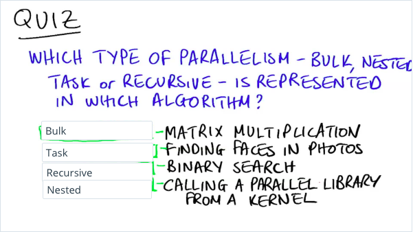
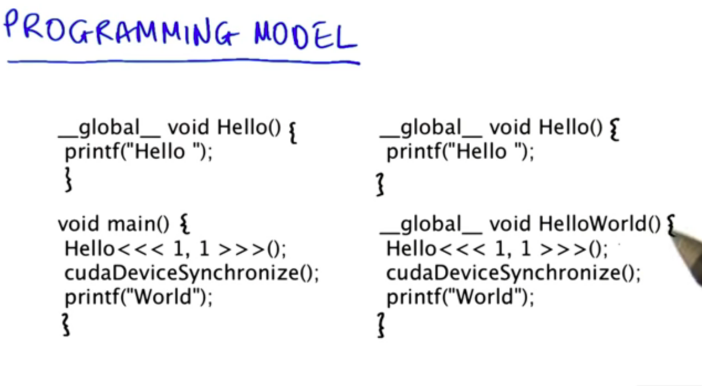
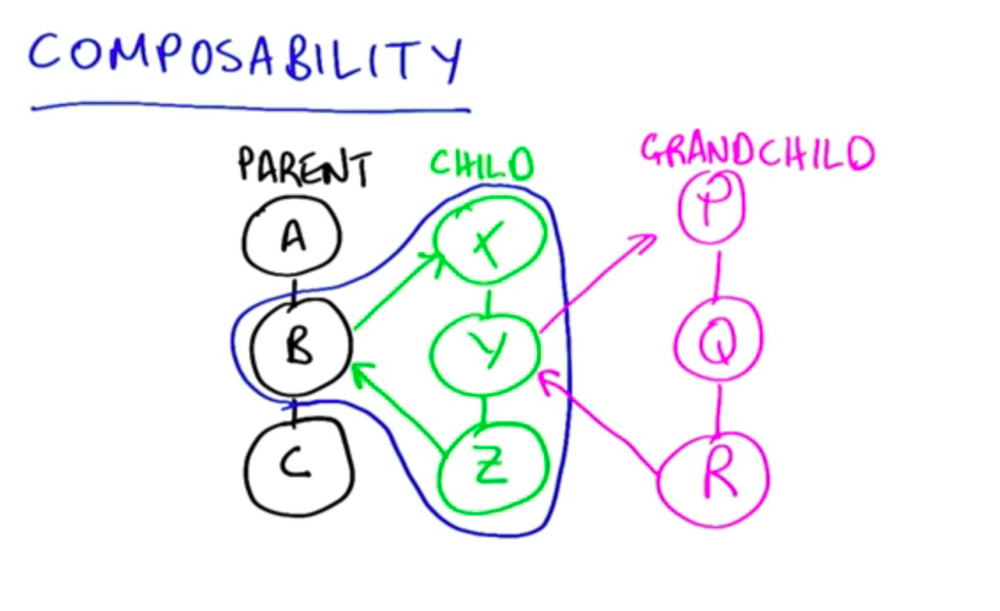
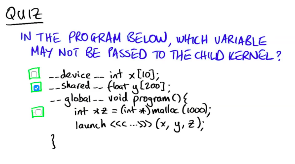
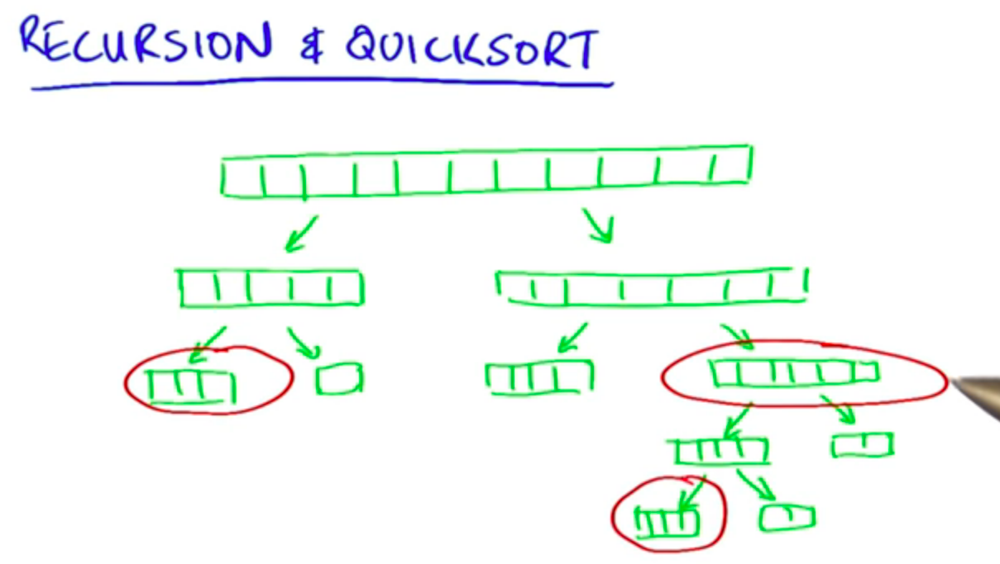
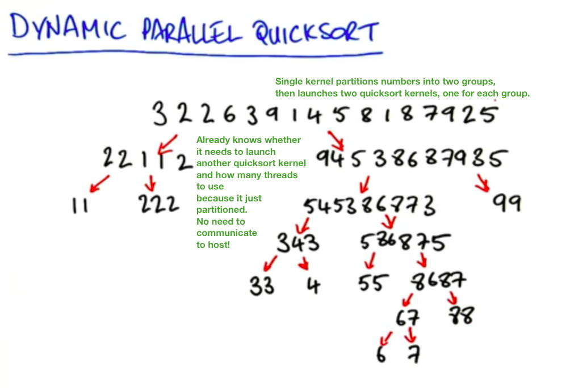

# Lesson 8 - Dynamic Parallelism

Broadens the number of problems you can do on GPU. GPU is really good at very broad bulk parallelism. A less regular problem and more diverse or fine grain parallelism is hard to express in CUDA without dynamic parallelism.

Recursion or task parallelism are difficult to express in a *single big grid of threads* paradigm.

*Bulk parallelism:* every thread is operating at the same time without any dependencies (e.g. map).


With *dynamic parallelism*, programs can user other power patterns as well. 

*Nested parallelism:* call a parallel function from within my parallel program. CPU does not have to launch kernels, easier to write.

*Task parallelism:* run multiple independant tasks each on their own data. Could be launched from the CPU but the GPU is good at running lots of things at once. One program with multiple instances handling multiple input data at the same time on GPU without complicated CPU GPU communication.

*Recursive parallelism*



## Programming Model

Simply use all the CUDA you learned so far but use it inside of a kernel:

* Kernel launches
* Streams
* Events
* Synchronization

So a *CUDA from the GPU program* looks almost exactly like a *CUDA from the CPU program*.



## Composability

A -> B -> C

C cannot run before B finished which cannot run before A finished. This is how *streams* in CUDA work.

Assume that B creates its *child work* X -> Y -> Z (B being the parent of X, Y, Z). 

*Composability* means that whatever B launches is entirely private to B. C does not know and does not care what B is doing. C cannot start before X, Y, Z belonging to B have finished. B looks like a single kernel even though internally it is doing additional steps.

You could also have grandchildren of B...



## Things to look out for

1. Keep in mind that **every thread executes the same program, every thread launches the child kernel, lots of kernel launches!** If you just want one launch, you have to explicitly select a single thread.
2. Each block executes independently: all streams and events are private to that block which created them. Objects like streams and events that you create inside a block can be used by any thread in that block but **not** by threads in other blocks including children. So you can synchronize on kernels launched within your block but **not** on work launched in another block. You can't pass streams or events to your children and have them synchronize on it or you risk a deadlock.
3. Data that is private to a block (i.e. shared memory) is truly private to that block! You cannot pass shared memory to child kernels! If you want data in shared memory to be seen inside a child kernel, you first have to write it to global memory!



`x` is being declared at global scope and `z`being allocated on the heap:

Memory allocated with `malloc()` inside a kernel is allocated from the heap, and is global.

## Application: recursion & Quicksort

Quicksort was very difficult to parallelize before dynamic parallelism and is now very easy!

Quicksort is a *divide and conquer algoritm*. It partitions an array of data into two pieces based on what is smaller or larger than a pivot element.

You then call quicksort on each sub-partition.



Number of elements in the sub-partitions are usually not the same, also some branches might be deeper than others.

Decision on whether I need to sub-sort can only be made after partitioning.

This makes it hard to parallelize on GPU without dynamic parallelism because one would have to communicate back to host all the info about what should be launched next.

Also at each level we would have to wait for the kernel that takes longest before the host launches the wave of kernels for the next depth level.

Dynamic parallelism solves both problems:

The second problem is solved because the new kernels are launched as soon as the parent finished partitioning, no need to wait for entire level of depth to finish before host launches a new wave of kernels => GPU is kept very busy.



```
__global__ void quicksort(int *data, int left, int right) {
	int nleft, nright;
	cudaStream_t s1, s2;
	
	partition(data+left, data+right, data[left], nleft, nright);
	
	if (left < nright) {
		cudaStreamCreateWithFlags(&s1, cudaStreamNonBlocking);
		quicksort<<<..., s1>>>(data, left, nright);
	}
	if (nleft < right) {
		cudaStreamCreateWithFlags(&s2, cudaStreamNonBlocking);
		quicksort<<<...,s2>>>(data, nleft, right);
	}
}
```

Two children launched into *separate streams*, thus, executed asynchronously at the same time! **Without these streams, everything would run sequentially!**


